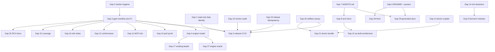

# Bridge Plan: beads_rust (`br`)

## Current assessment — 2026-09-06

**The core tracker works, and the September 4 functional gaps have been fixed
on `main`. Useful performance acceptance and delivery of those fixes in a new
release remain unfinished.** This refresh found a smaller additional defect:
live schema help still tells agents to read structured errors from stderr,
although the implemented contract uses stdout. Some architecture sketches also
describe the historical design as though it were the implementation.

This section supersedes the dated status below without erasing its evidence.
Assessment bead: `beads_rust-fhym3`. The reviewed checkout is `36dd4145`; its
executable sources equal `954156ac8e7d8f2dbc1cb87ccfc0157031dd8802` (the intervening
commit changes only Beads). This assessment changes the plan and task graph;
it does not implement the newly identified documentation fix or close the
performance/release contracts.

### Evidence collected and its limits

- Read **all 1,087 lines of AGENTS.md and all 1,384 lines of README.md** anew.
  Read the entire existing bridge and current architecture, engine operating
  model, health contract, capacity acceptance matrix and E2E coverage matrix.
  Rechecked current CI performance contracts and relevant code/proof paths.
  The earlier full reading of the historical porting, Rich, write-combining,
  TOON and research documents remains applicable: a diff from the previous
  assessment finds those documents unchanged. Their supersession decisions
  still apply; this is not a claim to have freshly reread every archived line.
- Rechecked CLI dispatch/startup, MCP request policy installation and resource
  routing, init output and schema registration, the independent storage model,
  coupled histories, and ID generation. A fresh source keyword scan found no
  `todo!`/`unimplemented!` implementations; its sole TODO match is a test string.
  The previous AST audit remains separately attributed historical evidence.
- [Current-source CI run 34047413559](https://github.com/Dicklesworthstone/beads_rust/actions/runs/34047413559)
  completed on September 6: Check, security, quick E2E, audit guards,
  reliability, all five test shards, all five platform builds, version audit,
  benchmark build/package and all four measurement shards passed. **The overall
  run failed:** its final benchmark gate exited 2 because calibrated
  per-workload budgets were missing. Collection success is not acceptance.
- Downloaded and inspected actual job logs. The all-feature lib run reports
  3,061 passed / 11 ignored; bins 67 passed; doc tests 10 ignored; the separate
  default lib run reports 2,969 passed / 4 ignored. The real MCP stdio target
  ran **10 tests, all passed, none ignored**. The linearizability target reports
  176 passes, including shared helper tests; these are not 176 independent
  concurrency scenarios. Do not sum repeated helpers into a product coverage
  percentage. The previously recorded model/stress proofs retain their source,
  timeout/retry and ignored-case boundaries.
- Downloaded Linux x86_64 CI artifact `9993693641`, verified provider ZIP digest
  `16eaf830832372a4b4f9a526a56ccdf6590a10dd7c8a64ca6dde8589c1bd8737`.
  Its 27,372,584-byte release binary hashes to
  `a6d1abdc39e14398d30843b2303d858200dec3c2a0e8cb53e5ad3fa954524f30`,
  reports source `954156ac`, default `self_update`, and FrankenSQLite 0.3.16.
  Executed it directly: **45/45 selftest steps passed**, including real
  persistence, blocking/unblocking, export/import and doctor. Workspace retained
  at `/dev/shm/br-reality-20260906/br-selftest-Mvh9V9`.
- A separate strict-stdout probe confirmed typed init JSON, actual stored IDs,
  dependency refusal, capacity refusal without changing the issue, unblocking
  after close, the init schema in `schema all`, clean sync status and doctor.
  The probe itself needed two corrections: a blocked issue reaches dependency
  admission before capacity, and `schema init` is not a supported selector.
  Those failures remain in `strict-lifecycle.jsonl`; they are fixture/operator
  mistakes, not product regressions. No Git repository was created by these
  commands. Full stdout/stderr and selftest receipts are retained under
  `/dev/shm/br-reality-20260906/`; this local scratch retention is not permanent
  release evidence.
- The GitHub latest-release endpoint still returns
  [v0.5.10](https://github.com/Dicklesworthstone/beads_rust/releases/tag/v0.5.10),
  published September 4 at source `6c8283c4`, engine 0.3.15. Its older native
  archive canaries do not certify current engine/MCP/init changes. Current CI
  artifacts report the same package version, so **source and digest**, not the
  version string alone, distinguish them. No new release was published here.
- The installed tracker binary's `br doctor --json` on this repository exits
  **1**, with `ok: false` but `workspace_health: healthy`: stale merge anchor,
  a retained temporary base variant reported by two checks, and 11 preserved
  recovery artifacts. This is not a clean doctor result or a new data-loss
  finding. The older `di3tb` zero-warning aspiration does not authorize deleting
  evidence. All artifacts remain in place; the existing deferred decision trail
  now records the current counts and exact diagnosis.

### Vision checklist, refreshed without dropping goals

`WORKING` means supported within the exercised scope, not universally proven.
`UNPROVEN` is distinct from broken. V numbers preserve the original inventory.

| Goal | September 6 status and remaining obligation |
|---|---|
| V1 CRUD, dependencies, labels, comments, queries | WORKING; direct current-binary selftest and hosted shards |
| V2 SQLite + JSONL | WORKING; current engine and explicit sync exercised |
| V3 Non-invasive collaboration | WORKING; no automatic Git/hook/daemon requirement introduced |
| V4 Classic-bd interchange | WORKING in documented scope; identical database schemas intentionally superseded |
| V5 IDs and deduplication | WORKING; remaining architecture ID description needs correction (R11) |
| V6 Go conformance | Existing pinned bd 0.46 proof applies to its stated scope; require current-candidate release evidence |
| V7 Structured results/errors | Init fixed; live schema help contradicts the error stream (R11) |
| V8 TOON and precedence | Init proof now includes TOON/environment/quiet precedence |
| V9 Rich/plain | WORKING within existing goldens and hosted tests |
| V10 Markdown/syntax | Live Markdown works; separate dormant renderer remains superseded |
| V11 Sync safety | Current reliability/engine tests pass; preserve failure and authority guards |
| V12 Acknowledged-data preservation | Stronger model/stress/fault evidence; remains bounded proof, not a universal theorem |
| V13 Merge/reconcile/salvage/plans | Implemented; exact CASS rehearsal remains an operator-dependent separate task |
| V14 Local history | WORKING; current selftest and hosted history tests |
| V15 Workflow policy/capacity | CLI/MCP parity fixed, including long-lived policy refresh and refusal postconditions |
| V16 Stale-claim diagnosis | WORKING as advisory evidence; no automatic reclaim introduced |
| V17 Routing/external dependencies | Existing tests retained; local atomicity does not promise distributed transactions |
| V18 Doctor/repair/bundle/migration | Current engine proof completed; direct current-binary doctor passes |
| V19 MCP tools/resources/prompts | Policy and literal-URI defects fixed; 10 actual stdio tests passed |
| V20 Cold/warm startup and faster-than-bd objectives | Cold-cache and comparative performance remain UNPROVEN; preserve explicit workload definitions |
| V21 Useful latency/size regression budgets | Size mechanism exists; latency calibration and accepted complete matrix remain unfinished |
| V22 Storage abstraction/decomposition | SUPERSEDED as a shipping prerequisite; concrete single-engine architecture retained |
| V23 Write-combining/cache | SUPERSEDED as a shipping prerequisite; do not wire in dormant code without evidence |
| V24 Cross-platform distributions | Older release works; newer-source native archive canaries/publication remain |
| V25 Cargo installation | Older published crate verified; newer candidate is not yet released |
| V26 Explicit self-update | Existing checksum-verified mechanism retained; new version delivery is separate |
| V27 Meaningful oracles | Ready/blocked and coupled-history blind spots fixed, with deliberate negative controls |
| V28 Unsafe discipline | Deny-by-default and three sanctioned exceptions retained |
| V29 Accurate actionable docs | September 4 semantic fixes landed; remaining live-help/design-sketch contradictions R11 |
| V30 Honest task status | Performance/release parents remain open; refresh stale executable descriptions |
| V31 Windows | Current platform build passed; older release selftest is not a current-artifact native canary |
| V32 Broken pipes | Existing exercised contract retained; no new failure observed |
| V33 Acceptance items | MCP enforcement and CLI/MCP parity proof now included |
| V34 Agent hints | Init repaired; schema error-stream hint still wrong (R11) |
| V35 One-command selftest | Current downloaded binary passes all 45 steps; keep platform scope explicit |

### Performance evidence: collection works, acceptance does not yet

Before opening receipts, audit comment 1181 fixed the inspection order: all A/A
controls first, with no A/B-derived threshold selection. All four ZIPs matched
their GitHub artifact digests:

| Artifact | Workload shard | SHA-256 |
|---|---|---|
| 9994083767 | 1k default flush | `054a32c0506353a83558e67b1056cf3c4ee98a4f9ddf8cdbe16292e9e8e22248` |
| 9994104707 | 1k diagnostic | `b4efcb8b099ecbfc6fbc0e8dd031f4298d16c347481ec9369553b38f154a821e` |
| 9994795458 | 10k default flush | `ddea6aae40e922a54b547709fe6b08eed17410685dac93bdc0a63df2db8b28f5` |
| 9994556233 | 10k diagnostic | `d74c37d1b1f67c403a2599ecff83e549c8dc5df48f199f5c5be3cb1ead239525` |

All **28 A/A workloads** contain 404 raw ABBA rows, eight warmup observations,
198 retained observations per side, successful process/collector/log-capture
exits, and equal side identities. Each shard has one distinct Linux boot ID;
the newly added boot-identity field is present in real hosted receipts. This
audit did not open A/B measurements or validate cross-phase A/A–A/B matching.

The unchanged binary's conditional p95 upper relative bounds range from
**8.723% to 1,029.023%**. Even the 1k/default ready comparison has a 23.749%
upper bound. Ninety-nine blocks yield finite endpoints, not necessarily useful
precision; low runner load does not prove independent identically distributed
blocks. These are per-comparison bounds, not simultaneous 28-workload coverage.
No stable budget is accepted from these controls, and no cause is assigned to
the long tail without profiling.

Descriptive same-binary default-flush medians include 1k ready 46.037 ms,
1k update 73.478 ms, 10k ready 313.140 ms and **10k close 1,434.577 ms**.
Different shards ran on different VMs; default-versus-diagnostic differences
cannot establish the causal cost of auto-flush. Fresh-copy/warm-filesystem
measurements do not establish cold-cache startup or superiority to Go bd.

The separate planted control performs 20 real ready invocations on its second
side: 504 total invocations, all successful; medians 47.900 versus 904.943 ms;
the actual comparator returns **Regression / exit 1** at its fixed diagnostic
100% threshold. This proves gross-slowdown sensitivity, not small-regression
sensitivity or an accepted production latency allowance.

### Initial bridge and task coverage

| Priority/order | Gap and bounded next action | Existing owner / required proof |
|---|---|---|
| P1, performance | Diagnose precision and expensive writes before setting budgets; preserve all samples and acknowledgment guards | `zxfz.1` calibration; active `naul5` runtime profile; `azxef.10` pass/fail/refusal companion |
| P1, release | Finish source-coherent CI/size/native-canary evidence for the next candidate and publish through existing machinery | `uze9`; final `0wb0w` integration |
| P2, independent quick fix | Correct schema error-stream help and misleading architecture sketches using current code contracts | R11: `azxef.14` implementation; `azxef.15` companion proof |
| Explicitly parked | Generator, gate registry, dormant deletion, sample-index cleanup and exact CASS operator data | Existing deferred beads; do not resurrect them as release blockers |

R11 is reproduced by the downloaded binary's `schema --help`: the `error`
target says "stderr JSON when robot mode or non-TTY", while the captured
structured `VALIDATION_FAILED` and `WORKFLOW_CAPACITY_EXCEEDED` errors are on
stdout. Source: `src/cli/mod.rs::SchemaTarget::Error`. Architecture's ID
algorithm says random bytes; `IdGenerator::generate_candidate` hashes a seed of
issue metadata/time/nonce instead. Review the nearby abbreviated configuration,
error and publication examples so illustrative design is not presented as
copyable current API. Do not change working error streams or ID semantics to
make stale prose true; the existing error-stream and ID tests are the authority.

The original R1/R2/R3/R4/R5/R8/R10 fixes now have closed implementation/proof
beads and current hosted evidence. R7's current-engine work also has completed
stress/foreign-sidecar evidence. Performance, current-release acceptance and
R11 remain; neither closed-task totals nor the green collection jobs close them.

### Ambition revision 1: make the next experiment answer a question

The first revision replaces "rerun the matrix and choose budgets" with an
explicit decision sequence. More collection alone has already failed to make
the acceptance contract useful. Before the next full matrix, `zxfz.1` must
specify the workload, useful regression size, runner/cache conditions, fixed
sample/stopping rule and what an inconclusive control will trigger. Preserve
the original startup objectives separately. A/A variability is evidence about
measurement precision, not permission to tolerate an equally large slowdown.
Do not repeatedly change sample counts or select a quieter-looking run after
seeing candidate outcomes. Keep untouched A/B measurements held out until the
calibration decision is recorded.

For `naul5`, the next useful investigation is a bounded profile of the expensive
10k close/update path on the same identified machine and fixture. Attribute
startup/open, transaction/commit, graph/cache work and publication costs before
choosing a code change. A deliberate same-host default/diagnostic comparison
can test export cost; the existing four-VM measurements cannot. The old
flush-lock cause was disproved in comment 970, and schema-witness plus
update/close connection reuse have already landed. Preserve those findings in
the executable bead description so a future agent does not repeat the wrong
optimization. Do not reclaim the active owner merely to refresh the plan.

Both tasks use the existing collector/comparator/profile surfaces. Keep
negative controls, current engine reliability, sync authority, complete raw
outputs and unknown-commit outcomes intact. If timing precision remains
insufficient, record that result and the narrowed cause; do not alter the gate
to turn inconclusive into pass. Runtime fixes require their existing unit,
real-workspace, multiprocess and fault-injection proof obligations; a timing
gain cannot waive an acknowledged-data regression.

### Ambition revision 2: deliver one identifiable candidate

The second revision treats release acceptance as a source-and-artifact handoff,
not a pile of independently green historical jobs. `uze9` should reuse current
successful checks whose executable inputs are unchanged, while requiring new
evidence for any changed source, lockfile, feature set or archive. Build success
on five platforms is distinct from running the downloaded native archive. Keep
one compact candidate record of source, lockfile, engine, features, binary and
archive digests, size decisions and native canaries; store that summary with
durable release evidence rather than relying solely on expiring job artifacts.

Preserve the existing seven-target size boundaries and their explicit product
allowances (1 MiB binary, 512 KiB archive relative to verified v0.5.10 assets).
These are separate from statistical latency budgets. A checked Linux CI binary
or its ZIP size cannot certify every published tar/ZIP archive. A new release
must accurately identify the newer engine and delivered behavior; matching
the old `0.5.10` version string is insufficient.

Execution can advance along two independent paths: finish R11 and its proof
while the existing performance owners resolve calibration/profile evidence.
Neither path waits for a documentation generator, dormant-module deletion,
exact CASS operator data or sample-index cleanup. Final `0wb0w` acceptance
still requires both paths plus the relevant release evidence. Do not add a
parent dependency that makes calibration depend on its own proof descendant.
The engine workaround remains until an actual pinned release and probe justify
removal; that cleanup is not a prerequisite for a correctly contained release.

### Audit TODO and refinement record

- [x] Read full current AGENTS/README and applicable historical/current vision.
- [x] Inspect changed code, actual assertions, hosted results and release identity.
- [x] Exercise the current downloaded binary and inspect all A/A controls.
- [x] Write current goal/gap/evidence inventory in this existing plan.
- [x] Apply frozen bead-generation prompt and add only uncovered R11/proof tasks.
- [x] Complete two substantive ambition revisions in place.
- [x] Regenerate covered Beads from the revised plan, preserving ownership.
- [x] Run five frozen refinement passes, ending with a no-change pass.
- [x] Validate actual ready work, cycles, dependency order and preserved ownership.
- [x] Close only the audit bead, preserve evidence and hand off remaining work.

The frozen generation prompt was applied twice (audit comments 1182/1185),
with two in-place ambition revisions between them. The unchanged refinement
prompt is recorded in comment 1187 and was applied for five reviews:

| Pass | Review and outcome |
|---|---|
| 1 | Goal/ownership coverage: corrected the stale Track F parent status; kept all 35 goals and existing owners |
| 2 | Proof sufficiency: real error streams, partial results, negative controls and actual persistence; no further amendment |
| 3 | Statistical honesty: all 28 final workloads, precision, cache/boot matching and held-out decisions; no further amendment |
| 4 | Scheduling/delivery: checked actual dependencies and release scope; no graph change needed |
| 5 | Final coverage/truth review, including retained doctor warnings; no further change found |

`br dep cycles --json` reports zero active cycles. `bv --robot-insights` also
reports no cycles with cycle computation enabled and no skip reason; its source
is this repository's SQLite tracker. `br ready --json` and the claimable `bv`
top pick agree: **`beads_rust-azxef.14`**. Its companion `.15` waits only for
that fix; `.10` waits for `zxfz.1`. Performance owners retain their claims.
The forecast's average confidence is only 0.439 and it includes parent/deferred
work; its dates are not delivery commitments. No new framework or cleanup
permission is needed to execute the ready fix.

## Historical assessment — 2026-09-04

This dated assessment supersedes the September 1 status and execution plan below.
The older material remains an audit trail, not a list of still-missing features.
This revision applies all phases of `reality-check-for-project`: vision extraction,
code and runtime investigation, gap mapping, a bridge plan, bead generation,
ambition rounds, refinement, and graph validation. Implementation belongs to the
resulting work queue; this assessment does not claim to have fixed its findings.

### Verdict and evidence boundary

**The core issue tracker works and has substantial independent release evidence.
It is not finished against its agent-facing contracts.** The largest newly found
gap is that MCP operations bypass the CLI's workflow policy. Direct probing also
found the ready resource dispatched as an issue lookup. Another concrete gap is
`init --json` returning prose. Performance targets remain unestablished,
and the green release must not be confused with the newer dependency tree.

The reviewed source started at `5e81e7961e43f4bf79d997b6d5d8beb425c90a70`
(fsqlite 0.3.16, fastmcp-rust 0.8.1, tru 0.2.4). During the audit another agent
committed the existing `UPGRADE_LOG.md` edit as `2334b42d`; no production code
changed with that commit. The installed v0.5.10 binary is commit
`6c8283c43773212ad1509c2caa4f400674674a50`, with fsqlite 0.3.15 and default
`self_update` features. Its SHA-256 is
`bf8e0c9c42fc966d8e1134206de7201cfe07a14e6b3c8527df650b87ae48f797`.

Evidence collected:

- Read all of AGENTS.md, README.md, the three historical porting documents, the
  Rich plan, the previous bridge plan, architecture and write-combining design;
  also read current engine, health, coordination, CI, and scaling contracts.
  Historical banners and later explicit decisions take precedence over abandoned
  designs: no new Storage trait, daemon, alternate engine, or dormant-code removal
  is needed to finish the current product.
- Inspected the exhaustive CLI dispatch, real command handlers, storage mutation
  and capacity paths, startup import/locking, sync publication/reconciliation,
  live Rich rendering, MCP handlers, and the assertions in proof harnesses.
  Keyword and Rust AST scans found no `todo!` or `unimplemented!` dispatch stubs.
  Dormant syntax/cache modules are documented decisions, not live CLI stubs.
- [Release run 33827552018](https://github.com/Dicklesworthstone/beads_rust/actions/runs/33827552018)
  succeeded at the v0.5.10 commit: reliability gates, seven builds, publication,
  crates.io, and downloaded-archive selftests on Linux amd64/arm64, macOS arm64,
  and Windows amd64. Canary receipts exist as workflow artifacts. They are not
  release assets and have the workflow artifact retention lifetime.
- Local `br doctor --selftest --keep --json`: **45/45 steps passed**, 4,715 ms,
  Linux x86_64, case-sensitive filesystem, supported no-replace rename. Retained
  workspace: `/data/tmp/br-selftest-rxUVp5`. This proves the exercised lifecycle,
  not every output contract, failure mode, platform, or performance target.
- Independent strict-parser smoke exercised dependency blocking/unblocking,
  cycle rejection, multi-label AND counts, JSON/TOON/plain output, and structured
  not-found errors. Receipt: `/tmp/br-reality-_azdbf9m/reality-receipt.json`.
  `init --json` failed the JSON contract; the other exercised forms passed.
  Structured errors intentionally use stdout, and partial-batch failures may
  emit two JSON documents, as documented in `docs/agent/ERRORS.md`.
- A current-source MCP binary on RCH worker `ovh-a` reproduced a hard-capacity
  bypass: the CLI refused the second `in_progress` issue with
  `WORKFLOW_CAPACITY_EXCEEDED`, while MCP accepted it and the CLI subsequently
  listed two issues against a hard limit of one. `resources/read` for
  `beads://issues/ready` returned `ISSUE_NOT_FOUND: ready`. Full policy, requests,
  responses and final state are retained on that worker in
  `/tmp/br-reality-policy-fi3phoje/reality-policy-receipt.json`.
- [CI run 33910709080](https://github.com/Dicklesworthstone/beads_rust/actions/runs/33910709080)
  at `829a8357` failed the misc and snapshot-freshness jobs. The exact difference
  is `env: BEADS_DB` newly appearing in root/create help. Snapshot suite: 258
  passed, 2 failed in the all-feature job. Functional shards and Check passed.
  This is a snapshot regression, not evidence that the new database alias fails.
- Fresh current-source tests completed through RCH: **2,969 lib tests passed,
  four ignored; one MCP protocol E2E passed**. The initial cold lib invocation
  hit the remote cap; successful re-execution used the already compiled test
  binaries. Source-content receipt barriers rejected concurrent plan edits, so
  the exact scope of the independent source comparison is recorded below.
  `UPGRADE_LOG.md` supplies separately attributed earlier
  lib/model/linearizability/MCP results; its migrated-family stress and doctor
  evidence for the engine bump was still pending when written.

### Current vision checklist

`WORKING` means implemented and supported by the named release/runtime evidence
for its tested scope. `PARTIAL` identifies a specific gap. `UNPROVEN` does not
mean broken. Historical goals explicitly retired in the as-built decision record
are `SUPERSEDED`, rather than new implementation obligations.

| Goal | Current status and evidence | Remaining work |
|---|---|---|
| V1 Classic CRUD, dependencies, labels, comments, queries | WORKING: dispatch, storage, release and local lifecycle | R1/R2 for alternate entry points |
| V2 SQLite + JSONL, no Dolt | WORKING: fsqlite facade and explicit sync | Engine proof R7 |
| V3 Non-invasive collaboration | WORKING: no automatic git/hook/daemon; explicit VCS reporting is allowed | Prose qualification R4 |
| V4 Go schema compatibility | WORKING within documented interchange scope; identical schemas SUPERSEDED by v17 and conformance decisions | R4: describe the narrower supported contract |
| V5 IDs and deduplication | WORKING: adaptive IDs and length-prefixed SHA-256; hashes intentionally differ from bd | R4 wording |
| V6 Go conformance | WORKING within pinned classic bd 0.46.0 comparison; text/schema exceptions documented | Retain divergence ledger and real-bd gate |
| V7 Machine-readable command results/errors | PARTIAL: `init --json` returns prose; error-stream contract otherwise deliberate | R2 |
| V8 TOON and precedence | WORKING on exercised forms; init inherits the same missing branch | R2/R5 |
| V9 Rich/plain mode behavior | WORKING: live output layer, goldens, runtime plain/TOON checks | Preserve mode matrix |
| V10 Markdown/syntax presentation | Markdown WORKING in IssuePanel; old separate syntax renderer SUPERSEDED/dormant | No new renderer project |
| V11 Sync paths, publication and conflict refusal | WORKING on release reliability suite; exact allowlist has documented external-path exceptions | R7/R8 evidence |
| V12 Preserve acknowledged data | PARTIAL proof, not a universal theorem: corruption containment, witnesses, crash tests exist | R7/R8 |
| V13 Merge/reconcile/salvage/reviewed plans | WORKING on synthetic and release tests | Exact CASS rehearsal remains operator-dependent |
| V14 Local history | WORKING on lifecycle and history tests | Keep explicit restore/prune semantics |
| V15 Workflow policy/capacity/gates | CLI WORKING; MCP PARTIAL because policy is not installed/evaluated | R1 |
| V16 Stale-claim diagnosis | WORKING as advisory caller-provided evidence | R9 tracker hygiene, no automatic stealing |
| V17 Routing and external dependencies | WORKING in CLI tests; no distributed transaction promised | MCP policy/read parity R1 |
| V18 Doctor explain/repair/bundle/migration | WORKING on release/fixture evidence; foreign sidecar diagnosis incomplete | R7 |
| V19 Seven MCP tools/resources/prompts | Real protocol and persistence WORKING; policy and resource routing PARTIAL | R1/R5/R10 |
| V20 <100 ms cold/<50 ms warm and faster than bd | UNPROVEN as a workload-qualified promise | R6 |
| V21 Useful regression budgets | PARTIAL: benchmark mechanism exists, command SLO/size contract parked | R6 |
| V22 Storage abstraction and decomposition | SUPERSEDED by explicit single-backend as-built decision | No mandatory trait or split |
| V23 Write-combining/cache | SUPERSEDED as shipping requirements; dormant opt-in research | Only reconsider with measured benefit |
| V24 Cross-platform distributions | WORKING: seven archives, checksums/signatures and four native canaries | R4 static-binary wording; durable receipts R7 |
| V25 Cargo installation | WORKING: crates.io publication and release manifest evidence | Source HEAD is newer than release |
| V26 Explicit self-update | WORKING with mandatory checksum sidecar verification | Preserve existing failure tests |
| V27 Meaningful tests and fault proof | PARTIAL: substantial real tests; model lacks ready/blocked oracle | R3/R5/R8 |
| V28 Unsafe discipline | WORKING as deny-by-default with three sanctioned carve-outs | R4 conflicting older count |
| V29 Accurate actionable documentation | PARTIAL: auto-import, schema/parity, static linkage and safety prose drift | R4 |
| V30 Tracker reflects work | PARTIAL: old parked tasks look ready; outdated epic descriptions | R9 |
| V31 Windows | WORKING within published Windows selftest; not proof of every filesystem | R7 platform evidence matrix |
| V32 Broken pipes | WORKING in existing E2E and release suite | Preserve text/structured distinction |
| V33 Structured acceptance items | WORKING in CLI/MCP parser and tests | Enforcement on MCP close R1 |
| V34 Actionable agent hints | WORKING on tested errors; init format failure escapes this surface | R2/R5 |
| V35 One-command binary selftest | WORKING, locally rerun and four published native canaries | Extend output proof R5 |

### Bridge work and initial bead coverage

**Completing the old open queue would not close the gap.** It omits R1, R2, R3,
R10 and the specific oracle gaps in R8. Generic closed MCP/JSON test beads do not
cover these counterexamples. Conversely, implementing every parked generator or
gate manifest would add work without repairing those counterexamples.

| Gap | Concrete change and acceptance | Ownership before this audit |
|---|---|---|
| R1 MCP policy parity (P1) | Load current workspace policy under request authority; apply ready groups, strict statuses/transitions, capacity, required fields, close gates/acceptance and audit attribution. Refusals must preserve all state; CLI and MCP must agree on the same fixture. | NO_BEAD |
| R2 Init structured output (P1) | Add a typed JSON/TOON init result through OutputContext, expose its schema/metadata, preserve plain/Rich/quiet behavior. Parse whole successful stdout with no prefix stripping. | NO_BEAD; closed `0a5` promised a JSON object but init.rs:272–293 has only quiet/Rich/plain branches |
| R3 Current help snapshots (P1) | Review and update only the root/create help snapshots changed by the BEADS_DB help addition; prove default and MCP feature modes and snapshot freshness. | NO_BEAD; older `zxfz.5` addressed different snapshots |
| R4 Semantic documentation drift (P2) | Correct README's explicit-only import claim against main.rs auto-import; qualify schema/text/hash parity, GNU versus musl static linkage, and recovery/unsafe counts. Add behavioral checks where appropriate; no wholesale generator requirement. | `wqmw` broadly; its only open child is a parked generator |
| R5 Contract test blind spots (P1) | Extend existing executable tests with strict success parsing and documented error-stream parsing; cross CLI/MCP policy fixtures, not just method discovery or text containment. Include disabled-feature behavior and mode precedence. | NO_BEAD for these cases |
| R6 Latency and size (P1/P2) | Establish reproducible workload-qualified budgets and benchmark update/close reuse on the same host; profile measured costs. Preserve correctness and persistence acknowledgment. | `zxfz.1`, active `naul5` |
| R7 Engine and release proof (P1/P2) | Finish current dependency-tree migrated-family stress/doctor receipts; retain the grouped-count workaround until the pinned engine includes and passes the upstream fix. Diagnose present-DB foreign sidecars conservatively. | `ro3m`, `w4rmw`, `uze9`, `0wb0w` |
| R8 Independent oracle scope (P2) | Extend the BTreeMap model to ready/blocked/dependency types and rejection postconditions; add bounded cross-issue concurrent histories for capacity/graphs. Keep the valid existing per-issue checker. | NO_BEAD for omitted projections/coupled histories; `dk45.7/.8` correctly cover narrower implemented scopes |
| R9 Tracker/decision hygiene (P2/P3) | Refresh epic closure criteria, record shipped evidence, keep active ownership, separate parked design ideas and operator-only actions from executable shipping blockers. | `di3tb`, `0wb0w`; cleanup/CASS decisions remain explicit |
| R10 Literal MCP resource dispatch (P1) | Ensure fixed issue resources resolve before the generic issue-ID template. Read every advertised fixed URI over actual stdio; preserve real/missing ID behavior. | NO_BEAD; discovered during refinement by direct runtime probe |

R1 code evidence: `src/mcp/mod.rs::mcp_ready_issues` uses
`ReadyFilters::default()` instead of the configured ready group. MCP writable
open calls `SqliteStorage::open` and attaches authority, but never installs the
capacity policy. `src/mcp/tools.rs::close_issue_json` calls `update_issue` before
looking up blockers and only warns afterward; it does not evaluate close policy.
`apply_update_issue_json` likewise uses the low-level mutation directly. CLI
`ready.rs`, `close.rs`, and `update.rs` contain the missing policy integration.
Capacity bypass is now reproduced over actual stdio. The broader policy cases
remain code-confirmed or specified companion-test coverage; the basic MCP smoke
does not establish them. The ready URI's routing failure masks its separate
configured-status mismatch until R10 is fixed. `IssueResource` is registered
before literal issue resources; confirm dispatch precedence in the pinned
fastmcp implementation before choosing the smallest routing fix.

R8 code evidence: `tests/model_based_storage.rs::check_projections` compares
issue fields, labels, comments, edge endpoints and list membership, but never
calls ready/blocked or compares edge types. Invalid operations are not generated.
`tests/linearizability_multiprocess.rs` deliberately constrains dependencies to
fixed sinks, making per-issue decomposition valid; that cannot establish atomic
capacity admission or multi-issue graph invariants.

Local performance observations (20 timed fresh processes after one warm-up,
warm filesystem cache, shared host, 2–23 issues): version median/p95 5.05/5.77 ms;
list 53.39/62.48 ms; ready 54.45/63.94 ms; create 104.10/133.53 ms. These are
diagnostic measurements, not calibrated 1k/10k budgets or a cold-cache benchmark.
The active performance bead already disproved the original flush-lock hypothesis
and landed schema-witness and update/close connection reuse improvements. Preserve
that evidence; do not resurrect lock-scope changes without a new profile.

### Execution and closure

#### Ambition revision 1: shared semantics and attributable proof

The first revision replaces isolated MCP checks with one request-scoped policy
context, built from the policy bytes actually loaded after authority acquisition.
Share the smallest existing semantic operations between CLI and MCP. Validate
before mutation; do not maintain two subtly different implementations. A long-lived
MCP process must observe policy edits on its next request, and its ready resource,
overview and prompts must agree with the CLI. Tests should retain the policy
digest, actor, requested transition and before/after state so disagreements can
be diagnosed without private workspace data.

Separate policy refusal from failures after a successful database mutation.
Refusals must leave issues, events, gates, dirty state and JSONL unchanged. A
publication error after commit must report the actual committed state and existing
pending-sync outcome, not claim rollback or invite a blind retry. Within each
issue operation, validate labels/parent/required fields before mutation wherever
their failure would otherwise leave misleading partial state. Preserve deliberate
per-item batch results; a batch-wide transaction is not an implied requirement.

The output proof uses a bounded table of real command families and explicit
contracts. Successful structured results consume the whole stream; failures use
the documented one- or two-document error contract. Help, completions and raw
exports are checked under their own contracts. Schema shape alone cannot prove
semantic parity. Default-feature builds must prove MCP is absent; feature-enabled
builds must report nonzero executed protocol tests.

Final closure records one coherent source/lockfile/feature/platform tuple, exact
commands and test counts, then identifies the release archives by digest. Older
release successes remain valid for that release, but cannot satisfy new engine
acceptance. Retain native canary summaries with durable release evidence before
workflow artifacts expire; extend existing release evidence machinery only if
needed. No new gates manifest or document generator is required.

#### Ambition revision 2: independent models and meaningful budgets

Keep the existing per-issue concurrent checker for its valid fixed-sink workload.
Add bounded histories whose conflict domains include all issues sharing a capacity
limit or connected by a graph mutation. Search legal sequential histories while
respecting invocation/response precedence. Decompose only where the operations
really commute; a shared capacity pool cannot be split by issue ID. Start with
two to four writers and short histories, memoize equivalent model states, and
classify exhausted search budgets as inconclusive. Preserve unknown commit
outcomes explicitly instead of discarding failed operations from the history.

An independent checker also needs evidence that it detects errors. Feed it small
hand-verified legal and illegal histories: oversubscribed capacity, a hidden cycle,
a stale blocker projection, and an acknowledged write absent after reopen. Each
illegal case must be rejected for its intended invariant; timeout is not rejection.
Use test-only trace/projection inputs, not production fault toggles. Record seed,
clock/barrier events, minimized history and model counterexample. The sequential
readiness model and coupled checker share a documented semantic specification,
but neither calls production cache/query logic as its oracle.

Rework `zxfz.1` around a release binary on a quiet, identified runner. Extend the
existing benchmark harness rather than create a debug-build latency integration
test. Measure representative 1k/10k fixtures with controlled graph/label density,
paired baseline/candidate runs in alternating order, warmups and repeated samples.
Publish distributions and uncertainty alongside ratios; establish command-specific
budgets from calibrated evidence. A copied database is not cold filesystem cache.
Retain the historical <100 ms cold/<50 ms warm startup objectives under a defined
startup workload; calibration cannot silently weaken them to obtain a green gate.
Record a measured miss as a gap, and report both wins and losses against real bd.
Label fresh-process/warm-cache measurements accurately, and keep real cold-cache
claims out of the gate unless that condition is controlled. Separate default
auto-flush from diagnostic no-auto-flush runs. Size evidence names target,
features, stripping and compressed/uncompressed bytes. Include a deliberately
degraded fixture/result to prove the regression gate fails. Existing `naul5`
remains owned; new measurements must not revive its disproven flush hypothesis.

First restore reviewed snapshot freshness and implement MCP/initialization
contracts, with their companion proof tasks. Documentation correction can proceed
independently. Then expand independent correctness oracles and establish stable
performance budgets. Engine-bump proof and upstream repros remain prerequisites
for claims about the newer engine. Final integration verifies one pinned source
and its published artifacts, rather than assembling unrelated green runs.

Every implementation task names existing source/test files, positive and negative
cases, exact reproduction commands, and retained failure evidence. Do not remove
files or change the engine, git behavior, partial-batch contract, or active owner
as a side effect of this plan. Parked architecture/generator ideas are decisions,
not prerequisites to finish these fixes. Exact CASS data and repository-index
cleanup require the separate operator actions already described in their beads.

### Workflow rounds and validation

The final campaign is `beads_rust-azxef`; its twelve children are self-contained
and include background, source locations, changes, tests, negative cases and
receipt requirements. All bead changes were made with `br`.

| Gap | Implementation owner | Companion proof / integration |
|---|---|---|
| R1 MCP policy | `azxef.1` | `azxef.7` |
| R2 Init structured output | `azxef.2` | `azxef.6` |
| R3 Help snapshot regression | `azxef.3` | Existing snapshots plus `azxef.6` |
| R4 Semantic docs | `azxef.4`, track `wqmw` | `azxef.6` and existing docs examples |
| R5 Entry-point/stream proof | `azxef.6`, `azxef.7` | Existing output/stdio harnesses |
| R6 Performance/size | `zxfz.1`; active optimization `naul5` | `azxef.10` |
| R7 Engine/sidecar/release evidence | `w4rmw`, track `uze9` | `azxef.11`, final `0wb0w` |
| R8 Independent models | `azxef.5`, `azxef.8` | `azxef.9` |
| R9 Queue/decision truth | Audit `ua6dh`; revised existing epics | `br ready`, `br dep cycles`, `bv --robot-*` |
| R10 Literal MCP resources | `azxef.12` | `azxef.7` |

Execution order: start concrete P1 fixes `.1`, `.2`, `.3`, `.12`; semantic docs,
independent models and calibrated performance preparation can proceed on their
named file scopes. `.6` waits for init/snapshots/docs, `.7` for policy/routing,
`.9` for both model tasks, `.10` for `zxfz.1`, `.11` for `w4rmw`. Updated tracks
feed `0wb0w`, which also depends on the campaign. Parent epics are organizational;
their high graph ranking is not a reason to claim an aggregate instead of a leaf.

Seven existing entries are explicitly deferred with preserved evidence and
revisit conditions: `uze9.2`, `wqmw.5`, `di3tb`, `di3tb.4`, `3r45.4`, `mwxp`,
and `ro3m`. The first two are parked designs, Track H and CASS require operator
inputs, `mwxp` needs a current reproduction, and upstream workaround removal
awaits a released/pinned fix. Track H is related to final integration rather
than a blocker. The active `naul5` claim was preserved. The old invalid test
issue `yh98` was observed and left intact; it is not executable ready work.

Initial bridge draft was converted into campaign `beads_rust-azxef` and seven
implementation/proof children before ambition work. Audit execution is tracked
separately in `beads_rust-ua6dh`; closing that audit does not close product fixes.

Ambition round 1 used the skill's prompt verbatim:

> That's a decent start but it barely scratches the surface and is light years away from being
> OPTIMAL. Please try again and revise your existing plan document in-place to make it MUCH, MUCH,
> MUCH better in EVERY WAY.

Result: shared request policy, preflight/post-commit outcome separation, bounded
strict-output contracts and source-bound durable release evidence were added
above, then carried into the corresponding beads.

Ambition round 2 used the skill's prompt verbatim:

> That's a lot better than before but STILL is a far cry from being OPTIMAL. Please try yet again
> and revise your existing plan document in-place to make it MUCH, MUCH, MUCH better in EVERY WAY.
> I believe in you, you can do this!!! Show me how brilliant you really are.

Result: bounded coupled-history verification, independently checked negative
controls and calibrated paired performance budgets were added in place and
converted into new proof beads or revisions of existing owners.

Refinement used the skill's frozen Phase 5 prompt verbatim, recorded in audit
comment 997 after rereading AGENTS.md. Five passes were insufficient because the
fifth found a scheduling defect; a sixth established convergence.

| Pass | Review result and actual revision |
|---|---|
| 1 | Replaced obsolete release/generator prerequisites; represented already parked designs and operator tasks as deferred, preserving their evidence. |
| 2 | Direct MCP probing confirmed capacity bypass and discovered literal-resource shadowing; added routing work, transport coverage and engine proof; corrected due versus defer semantics in the model. |
| 3 | Added behavioral automatic-import proof to semantic documentation; separated preflight, commit, publication and remote-transfer outcomes. |
| 4 | Refreshed Track F, preserved original startup objectives, made workload/baseline and failure evidence explicit, and deferred old unmeasured/upstream work with concrete triggers. |
| 5 | `br ready` exposed parent-inherited starvation that cycle metrics missed: Track F depended on proof `.10`, which depended on its own child `zxfz.1`. Changed cross-track links to `related`; final integration still requires the campaign. |
| 6 | Reread all twelve final children and revised epic dependencies; checked expected ready leaves, proof dependencies, preserved requirements, failure semantics, ownership and graph results. No further plan or bead changes were needed. |

Final validation evidence:

- Lib binary produced by `RCH_REQUIRE_REMOTE=1 rch exec
  --source-content-receipt -- cargo test --lib --locked` was re-executed through
  `rch exec --job -- <retained-lib-binary> --quiet` on `hz4`: **2,969 passed,
  0 failed, 4 ignored**, 240.92 seconds, remote exit 0. The initial compile took
  23m39s and its combined compile/test invocation exceeded the 30-minute cap.
- MCP binary produced by the analogous `cargo test --test e2e_mcp_protocol
  --features mcp --locked` invocation was re-executed through RCH job mode on
  `ovh-a`: **1 passed, 0 failed**, 1.58 seconds, remote exit 0. This is transport
  smoke proof; the separately reproduced policy/routing failures remain open.
- The initial source-content receipt attempts failed their post-command barrier
  because this plan was changing. Two clean-overlay retries began fresh caches
  and were explicitly cancelled in favor of the retained compiled binaries.
  Independent post-run comparison of all Rust files under src/tests/benches
  together with Cargo.toml/Cargo.lock/build.rs/rust-toolchain.toml (297 files
  total) matched locally and in
  both retained source roots: digest
  `66903719adcdd7473c11f7804eb7f38af94d99308e39e260c6f8f1b542aacd80`.
  This is a scoped source comparison, not a successful whole-tree RCH receipt.
- The MCP failure receipt was copied locally to
  `/tmp/br-reality-evidence-7g7ftwr6/mcp-policy-receipt.json`; its original worker
  workspace and the released-binary smoke/selftest workspaces were retained.
- Current-source [CI run 33920447209](https://github.com/Dicklesworthstone/beads_rust/actions/runs/33920447209)
  had Check and Security Audit green at the last inspection; remaining test
  shards were queued/running. Push-skipped reliability/build/version/benchmark
  jobs are not passes. The prior help-snapshot failure remains separately tracked.
- `br dep cycles --json`: zero cycles. `bv --robot-insights`: computed empty
  Cycles; `bv --robot-triage`: phase 2 ready, graph has no cycles. Actual
  `br ready` includes all nine intended implementation leaves, including restored
  `zxfz.1`, and excludes their dependent proof work. Graph rankings are advisory;
  the old forecast's low-confidence ETA is not a delivery commitment.
- `git diff --check` and `cargo fmt --check` passed. UBS was invoked on both changed files and exited 3
  because Markdown/JSONL are unsupported; **nothing was scanned**, not a pass.
  No Rust or workflow implementation changed in this audit. Product compilation
  and workflow gates remain mandatory in the implementation beads.

This audit creates one campaign, twelve implementation/proof children and one
completed-audit record. It does not close the campaign or claim its fixes shipped.

## Historical baseline — 2026-09-01

**Reality check date:** 2026-09-01
**Plan revision:** 3 (two ambition rounds applied in place; see §9)
**Baseline:** installed `br 0.5.7` = Cargo.toml 0.5.7 = latest GitHub release (2026-08-29); `main` at `ebc34bd7` (fsqlite 0.3.14)
**Gap count:** 6 critical, 14 major, 9 minor (29 gaps)
**Beads:** 16 open / 5 in_progress / 954 closed at check time; every open bead is unblocked
**Estimated work:** ~3 focused agent-weeks of code plus ~1 week of docs/tracker hygiene; engine-boundary items depend on upstream FrankenSQLite

This document is the Phase 2 output of the reality-check workflow. It is revised **in place** during ambition rounds and then converted into beads with the frozen Phase 3a template. Every gap carries enough context that a bead generated from it stands alone: background, current code locations, target, success criteria, implementation steps, tests and logging, dependencies, and bead coverage.

Guiding principles for every gap:
1. **Proof over prose.** A gap is closed only when a named test, gate, or receipt demonstrates it. Every implementation bead has a companion test with structured logging so failures are diagnosable from CI output alone.
2. **Structural parity, not copied lists.** Where the same check must run in four places (CI, release, DSR, local), one manifest drives all four.
3. **Docs as data.** Anything that can be generated from `br capabilities`, `Cargo.toml`, or the module tree is generated and checked, never hand-copied.
4. **No silent state.** Dormant code, stale claims, disabled workflows, and ignored tests each carry a reason, an owner, and a revisit trigger, or they are removed with approval.

---

## 1. Where the project actually is

### 1.1 What the reality check established

| Claim | Evidence |
|---|---|
| The CLI is real, not scaffolding | 88 leaf subcommands; exhaustive `match` in `src/main.rs:585-910` with no catch-all; zero `todo!`/`unimplemented!`/TODO/FIXME in production code; only stub is `br doctor explain` (`src/cli/commands/doctor_subsystems/surface.rs:1951`); only ignored flag is `br doctor capabilities --command` (`surface.rs:146`) |
| The shipped binary works end to end | 83-step lifecycle smoke against installed 0.5.7 covering init, create, deps, ready/blocked, labels, comments, claim, defer/undefer, close/reopen, epic, lint, auto-flush, all sync modes, doctor, migrate-schema plan, capabilities/schema/robot-docs, TOON, completions, config, agents, orphans, changelog, tombstone delete, capacity hard limit, cross-project routing, external deps. 81 passed; the 2 failures were README syntax the CLI rejects (Gap 6) |
| Sync safety invariant holds | `grep -rn 'Command::new.*git' src/sync/ src/cli/commands/sync.rs` is empty; bare `br sync` refused; 13 git-safety e2e tests in `tests/e2e_sync_git_safety.rs` |
| Latency is far inside the plan's targets | On the project's own 977-issue tracker: `ready`, `list --limit 0`, `show`, `stats`, `blocked`, `sync --status` each ~10 ms; `doctor --json` ~0.8 s |
| Unit suite on `main` has exactly one known failure | `cli::commands::doctor::tests::pending_sync_merge_authority_inspector_is_coherent_and_byte_identical` (GitHub #476) fails deterministically at `src/cli/commands/doctor.rs:14257`; the 11 lib failures recorded in bead `beads_rust-9krz` now pass; partial full run 1066 passed / 1 failed / 5 ignored |
| `cargo fmt --check` clean | local run |
| `cargo clippy --all-targets -- -D warnings` | **inconclusive**: killed by RCH's 5-minute cap on two workers; the last CI clippy run (2026-08-19) failed |
| Full integration suite | **could not complete** through RCH: a cold compile of 162 test binaries exceeds the 30-minute cap; UPGRADE_LOG.md (2026-08-14) recorded 21,490 passed / 0 failed |

### 1.2 Vision checklist (condensed)

Status legend: WORKING, PARTIAL, STUB, UNPROVEN, NOT_STARTED, DEFERRED, WRONG_APPROACH, REGRESSED.

| # | Goal | Source | Status | Gap |
|---|---|---|---|---|
| V1 | Classic bd command set ported (CRUD, deps, labels, comments, sync, stale, orphans) | porting plan | WORKING | — |
| V2 | SQLite + JSONL hybrid frozen; no Dolt | porting plan, README | WORKING | — |
| V3 | Non-invasive: never runs git for sync, no hooks, no daemon | README §Design 1, 3 | WORKING | — |
| V4 | Schema compatible with Go bd | PROPOSED_ARCHITECTURE | WORKING (superset) | — |
| V5 | Hash-based IDs, content-hash dedup | README, AGENTS.md | WORKING (hash bytes intentionally diverged at schema v14) | G7 |
| V6 | Output parity with Go bd proven by conformance tests | porting plan | UNPROVEN (workflow disabled; skips without a real `bd`) | G12 |
| V7 | Every command supports `--json`; clean stdout; structured errors with exit codes | README §Design 4, AGENTS.md | WORKING | — |
| V8 | TOON output and env precedence | AGENTS.md | WORKING | — |
| V9 | Rich TTY output, Plain when piped, NO_COLOR | README §Design 5 | WORKING | — |
| V10 | Syntax highlighting and markdown rendering in `show` | RICH_INTEGRATION_PLAN §5 | STUB / unwired | G14 |
| V11 | Sync never touches `.git/`; `.beads/` allowlist; atomic publish; conflict-marker refusal; `--force` gating | README §Safety Model | WORKING | — |
| V12 | "No data loss" guarantee | README §Safety Model | REGRESSED in Aug (GH #457/#458/#460/#461), fixed in 0.5.5-0.5.7; #471/#474 fixed only at HEAD | G1, G2, G4, G27 |
| V13 | 3-way merge, reconcile, reconcile-additive with hash-bound plans, salvage, source-path migration | README §Troubleshooting | WORKING (#473 dry-run fix unreleased) | G2 |
| V14 | Local history backups with list/diff/restore/prune | README | WORKING | — |
| V15 | Workflow policy: ready groups, capacity, required fields, gates | README §Workflow Policy | WORKING (#466 gate_results fix unreleased) | G2 |
| V16 | Coordination status / stale-claim evidence | README FAQ, COORDINATION_EVIDENCE | WORKING | G5 |
| V17 | Cross-project routing, town discovery, external deps | README FAQ | WORKING | — |
| V18 | Doctor: diagnostics, repair sessions, schema migration plan/apply/undo, fixtures | README, docs | WORKING except `doctor explain` stub, `--bundle` absent | G13, G21 |
| V19 | MCP server: 7 tools, 12 resources, 4 prompts, same lock model | README, AGENTS.md | WORKING in code; protocol behavior UNPROVEN by tests | G11 |
| V20 | Startup < 100 ms cold / < 50 ms warm; "br faster than bd" | PROPOSED_ARCHITECTURE App. C, porting plan | UNPROVEN (benches ignored, self-comparing budget) | G10 |
| V21 | Regression budgets enforced in CI | ci.yml bench job | DISABLED | G3, G10 |
| V22 | Pluggable `Storage` trait; module decomposition | PROPOSED_ARCHITECTURE §1.1, §5.1 | NOT_STARTED / WRONG_APPROACH (one 38k-line file) | G15 |
| V23 | Write-combining queue; S3-FIFO cache | WRITE_COMBINING_QUEUE_DESIGN, `src/cache.rs` | DEFERRED, dormant code | G9 |
| V24 | Cross-platform single-binary releases, signed, checksummed, installer, package manifests | README §Installation | WORKING | G19, G23 |
| V25 | `cargo install --git ... --locked` works from crates.io deps | README | WORKING (0.5.7 on crates.io) | — |
| V26 | Self-update | README | WORKING | — |
| V27 | Property, fuzz, snapshot, failure-injection, concurrency testing | docs/TESTING_GUIDELINES, ci.yml | WORKING (but no gate runs them) | G3 |
| V28 | Zero unsafe code | AGENTS.md | PARTIAL by design (`deny` + 4 carve-outs) | G7 |
| V29 | Docs are accurate enough for agents to act on | AGENTS.md purpose | FAILING (README config keys, AGENTS.md structure, ARCHITECTURE.md claims) | G6, G7, G8 |
| V30 | Beads are the single source of truth for status | AGENTS.md | FAILING (5 stale claims; August work untracked) | G5 |
| V31 | Windows support | README; GH #438/#439/#413/#419 | PARTIAL (open beads txwk, gc8l; no Windows test shard) | G17, G3 |
| V32 | Broken-pipe safety for text output | GH #434, bead 3fna | PARTIAL | G17 |
| V33 | Acceptance-criteria as structured data | GH #477 | NOT_STARTED | G20 |
| V34 | Agent-first: mistakes get actionable hints | README §Design 4, error taxonomy | PARTIAL (README-shaped mistakes get "Issue not found") | G28 |
| V35 | "Does this binary work on this machine?" is answerable in one command | implied by Aug platform bug stream (#438, #439, #413, #419, #444) | NOT_STARTED | G26 |

### 1.3 Would completing all open beads close the gap?

**No.** The 16 open beads are 8 sync bugs, 6 storage/engine bugs (4 of them upstream FrankenSQLite escalations), and 3 test tasks. They cover parts of G4, G16 and G17 only. Nothing tracks G1, G2, G3, G5-G15, G18-G29. The 5 in_progress beads are all stale agent claims; one (`beads_rust-uri0`) is finished per its own comments.

---

## 2. Critical gaps (block the vision or violate a stated guarantee)

### Gap 1: Read-only authority inspection mutates database bytes — REGRESSED → WORKING

**Current state:** `SqliteStorage::inspect_pending_sync_merge_under_authority` (`src/storage/sqlite.rs:19771`) opens the database through `open_current_read_only` (`src/storage/sqlite.rs:2503`), which registers a `DatabaseOpenerLease` and calls `open_with_flags(..., SQLITE_OPEN_READ_ONLY)`, then reads `connection_user_version`, then closes. The unit test at `src/cli/commands/doctor.rs:14234` snapshots db/wal/shm/journal bytes before and after (`database_family_bytes`) and fails: the main-file header differs in the change-counter / version-valid-for region (bytes 24-27 and 92-95 of the SQLite header). This is GitHub #476, reproduced on `main` at fsqlite 0.3.13 and 0.3.14. The invariant matters because this path runs during recovery when br must not disturb a database it does not own.

**Target state:** the inspection leaves every database-family file byte-identical; the unit test passes on Linux and macOS; the root cause is known and either fixed in fsqlite or isolated in br; the invariant is pinned at the storage layer and monitored at runtime.

**Success criteria:**
- [ ] `cargo test --lib pending_sync_merge_authority_inspector_is_coherent` passes on Linux and macOS.
- [ ] New storage-level test `open_current_read_only_is_byte_identical` asserts identity on a fresh v17 database with (a) no WAL, (b) a live uncheckpointed WAL, (c) a stale `-shm`; it logs a hex diff of the first 100 header bytes on failure.
- [ ] A doctor check `db.read_only_open_is_observational` runs the probe on a temp copy of the family and reports the diff offsets when it fails.
- [ ] If the cause is upstream, a minimal repro is filed against frankensqlite and linked; the br mitigation is documented in `docs/reliability/ENGINE_OPERATING_MODEL.md` (Gap 4).

**Implementation plan:**
1. Localize the write with a three-point byte snapshot inside the test: after `open_with_flags`, after `connection_user_version`, after `conn.close()`. Log which step changes offsets 24-27 / 92-95 and whether `-wal`/`-shm` appear.
2. Check fsqlite 0.3.14 for an immutable/observational open mode; if present, use it here. If read-only open still writes the header, file upstream with the repro and the byte offsets.
3. Make the br path observational regardless of engine behavior: read `user_version` and the pending-receipt state from a **shadow copy** of the family (copy db + wal + shm to a `tempfile::tempdir()` under the held authority, open the copy, discard). The sync code already has a byte-snapshot pattern; reuse it. Cost is bounded by DB size and this path runs only during recovery.
4. Add the storage-level test and the doctor check; wire the doctor check into `report.json` with `details.finding_id = "db-read-only-open-not-observational"`.

**Tests and logging:** unit test with hex diffs; doctor check emits `tracing::warn!` with offsets and file suffix; e2e in `tests/e2e_doctor_chokepoint.rs` runs the check on a fixture with a live WAL.
**Dependencies:** none. Blocks Gap 2.
**Estimated complexity:** M
**Vision goals served:** V12, V18
**Bead coverage:** NONE. Create a bug bead; link GH #476.

### Gap 2: Six user-reported fixes exist only at HEAD; release 0.5.8 — PARTIAL → WORKING

**Current state:** Commits after the `v0.5.7` tag (`d2393c99`, `70e7fed9`, `d461a399`, `676e57bc`, `10ea8ece`, `087ce812`, `34ca862b`, `ebc34bd7`) fix GH #466 (`gate_results` never written), #467 (`br update` silently replacing non-empty text fields), #471 (`doctor --repair` discarding `events`, `gate_results`, `gate_result_history`, `close_metadata`, `capacity_*` tables), #473 (`--reconcile-additive --dry-run` unreachable), #474 (bypass-policy audit never exported), #475 (`br list --tree`), two cross-issue comment-ID collision bugs, and bump fsqlite to 0.3.14. Users on 0.5.7 have all of these, three of which are silent data-loss or silent-audit-loss class.

**Target state:** `v0.5.8` released with these fixes behind a real gate, a CHANGELOG entry naming each issue, and a post-release canary receipt.

**Success criteria:**
- [ ] Release asset `br --version` prints 0.5.8; `cargo install --git ... --locked` resolves 0.5.8; crates.io shows 0.5.8.
- [ ] Release gate (Gap 3) passed on the release commit, including `cargo test --lib` and the stress gate (Gap 4).
- [ ] CHANGELOG.md lists #466, #467, #471, #473, #474, #475, the comment-ID fixes, fsqlite 0.3.14.
- [ ] Post-release canary (Gap 26's lifecycle self-test) passes against the downloaded asset on linux_amd64, darwin_arm64, windows_amd64, and the receipt is attached to the release.

**Implementation plan:**
1. Land Gap 1, or quarantine #476 with `#[ignore = "GH-476 ..."]` plus the doctor runtime check so the invariant is still watched.
2. Bump `Cargo.toml`, README "Verify Installation", `.claude-plugin/plugin.json`, CHANGELOG; run the version audit (Gap 19).
3. Tag; let `release.yml` build; make the crates.io publish step idempotent (Gap 23).
4. Run the canary; attach the receipt to the release notes and the bead close reason.

**Tests and logging:** the canary itself; release notes include the gate receipt JSON.
**Dependencies:** Gap 1 (or quarantine), Gap 3, Gap 19, Gap 23.
**Estimated complexity:** S
**Vision goals served:** V12, V13, V15
**Bead coverage:** NONE. One release bead; the per-fix traceability is the CHANGELOG plus the GH issues.

### Gap 3: Quality gates are off, and no single gate definition exists — DISABLED → WORKING

**Current state:** `gh workflow list --all` shows CI, Security Audit, Conformance, Doctor, Full E2E & Benchmarks, Notify ACFS, and Update Package Manifests `disabled_manually`; only Release and Dependabot run. The last CI run on main (2026-08-19) failed at "Clippy (all features)" and "Check for yanked dependencies". `release.yml` "Release Reliability Gates" runs four targeted tests only. DSR skips lib tests (bead `9krz`). Coverage is `continue-on-error`. Locally, RCH caps kill `clippy --all-targets` at 5 minutes and `cargo test` at 30 minutes; a cold compile of 162 test binaries does not fit. Four places (ci.yml, release.yml, DSR, `scripts/ci-local.sh`) each hand-list what to run, and they have already drifted.

**Target state:** one gate manifest drives CI, release, DSR, and local runs; every push to main and every release runs fmt, clippy (all-features and no-default-features), `cargo test --lib`, sharded integration tests, doctor fixtures, and the stress gate, each inside GitHub and RCH time caps; results are visible and required.

**Success criteria:**
- [ ] `gates.toml` at repo root lists named gates (`fmt`, `clippy-all`, `clippy-min`, `check`, `lib`, `shard-e2e-1..n`, `shard-storage`, `shard-conformance`, `doctor-fixtures`, `stress`, `bench`, `version-audit`) with command, timeout, and required-for `{push, release, local}`.
- [ ] `scripts/gate.sh <name|all|release|push>` executes gates from the manifest; `ci.yml`, `release.yml`, DSR, and `ci-local.sh` all call `scripts/gate.sh` and contain no hand-written cargo test lists.
- [ ] `tests/gate_manifest.rs` asserts every workflow's cargo invocations come from the manifest and every `tests/*.rs` binary is assigned to exactly one shard.
- [ ] `gh workflow list --all` shows CI, Security Audit, Doctor, Conformance active; three consecutive main pushes are green.
- [ ] Each shard finishes in < 25 minutes from cold on an RCH worker; documented in AGENTS.md (Gap 25).
- [ ] Coverage job either enforces a threshold or is removed (Gap 22).

**Implementation plan:**
1. Diagnose the 2026-08-19 failures on a warm worker: run clippy all-features and `cargo audit --deny yanked` (install cargo-audit); fix lints per the existing allow-list policy; replace or bump the yanked crate.
2. Measure per-binary compile+run time on one warm worker (`cargo test --test X --no-run` timings) and partition `tests/*.rs` into shards of ≤ 20 minutes; write `gates.toml`.
3. Implement `scripts/gate.sh` (bash, reads the manifest with a tiny TOML parser or a checked-in generated shell fragment) and the manifest test.
4. Rewrite `ci.yml` jobs as a matrix over shards; add a `windows-latest` shard running `e2e_sync_artifacts`, `e2e_wrap`, `e2e_terminal_sanitization`, and the Windows auto-export scenario (Gap 17).
5. Extend `release.yml` gates with fmt, clippy, lib, stress (Gap 4), version audit (Gap 19), and the post-release canary job (Gap 26).
6. Re-enable workflows one at a time with `gh workflow enable`, watching each; add `scripts/check-workflows-enabled.sh` that fails if any expected workflow is disabled, and run it in the Security Audit job.
7. Record the policy in `docs/CI_SUPPLY_CHAIN.md`.

**Tests and logging:** `gate_manifest.rs`; each gate prints a one-line receipt `gate=<name> status=<pass|fail> elapsed=<s>` to stdout and to `artifacts/gates/<name>.json` for upload.
**Dependencies:** none. Blocks Gap 2, 4, 10, 11, 12, 16, 22, 25.
**Estimated complexity:** L
**Vision goals served:** V21, V27, V6, V31
**Bead coverage:** PARTIAL (`hrhx` doctor fixtures on RCH). Everything else uncovered.

### Gap 4: Storage-engine reliability is contained, not governed — PARTIAL → WORKING

**Current state:** In August, v0.5.3 on fsqlite 0.3.11 corrupted a healthy database family under concurrent multi-process writes (GH #457, #458, #460, #461). A stock-SQLite backend was built and reverted by the operator; containment landed as a sole-opener WAL checkpoint lease (`.br-db-openers-*.lock`) with stress receipts. Open beads `ro3m`, `f3r4`, `ajui`, `891u`, `avhq` are engine-boundary issues; Gap 1 is another. In_progress bead `uri0` is finished per its own comments and still open at P0. No document states the operating model or what must pass before an fsqlite bump; `scripts/br-stress.sh` exists but gates nothing.

**Target state:** the operating model is written; every engine-boundary bug has an upstream issue and a br regression test; fsqlite bumps and releases are gated by a stress harness and by the differential/linearizability harness of Gap 27; doctor reports engine state.

**Success criteria:**
- [ ] `docs/reliability/ENGINE_OPERATING_MODEL.md`: FrankenSQLite-only decision and why (no FFI, memory safety), containment mechanism, sidecar files (`-wal-cert`, `-wal-cert-head`, `-ns-gate`, `-ns-use`, `.fsqlite-migration-state`), recovery-artifact policy, the fsqlite-bump checklist, and the escalation template.
- [ ] `stress` gate in `gates.toml` runs `scripts/br-stress.sh` at N=8 for 60 s and 90 s, asserts zero recovery artifacts, `integrity_check` ok, rowid monotonicity on `issues`, and DB↔JSONL parity; required for release and for any PR touching `Cargo.toml` fsqlite lines.
- [ ] Beads `ro3m`, `f3r4`, `ajui`, `891u`, `avhq` each link an upstream issue and carry a `tests/repro_*.rs`.
- [ ] `br doctor --json` gains `engine: {name, version, sole_opener_lease, recovery_artifacts, sidecars}`.
- [ ] `uri0` closed with its recorded outcome.

**Implementation plan:**
1. Close `uri0` (outcome: containment at `dedfbed7`, stock-SQLite reverted at `a704e8b8`, releases 0.5.5-0.5.7, root cause upstream fsqlite #399).
2. Write the operating-model doc from the uri0 comment trail, `docs/fsqlite_trailing_pages_report.md`, and `docs/SWARM_SCALE_TUNING.md`.
3. Harden `scripts/br-stress.sh` into a gate with a JSON receipt; add the post-conditions above.
4. For each engine bead: minimal `tests/repro_*.rs` (ignored only with the upstream link in the reason), upstream issue, fix-version tracking.
5. Add the doctor engine block; surface it in `br info --json` too.

**Tests and logging:** stress receipt JSON with per-process op counts, error counts, artifact list; repro tests log the fsqlite version under test.
**Dependencies:** Gap 3 (gate wiring). Feeds Gap 27.
**Estimated complexity:** L (br side) plus upstream time
**Vision goals served:** V12, V2
**Bead coverage:** PARTIAL (`ro3m`, `f3r4`, `ajui`, `891u`, `avhq`, `uri0`). New beads: operating-model doc, stress gate, doctor engine block.

### Gap 5: The tracker no longer reflects the work — FAILING → WORKING

**Current state:** 270 commits and three releases landed between 2026-08-18 and 2026-09-01 against 12 closed beads; closed-per-month went 165 → 111 → 62 → 11. All five in_progress beads are stale agent claims by the AGENTS.md rule: `0v1.2.4` (36 days, the graph's only blocker), `3r45.1` and `3r45.2` (36 days), `mwxp` (6 days, bypassed by `9krz`/`891u`), `uri0` (4 days, finished). GH issues are fixed from commits without beads. Doctor on this repo's `.beads/` warns about a stale merge base and four retained recovery artifacts.

**Target state:** every in_progress bead has a live owner; every GH-issue fix references a bead; the backlog contains a bead for every gap in this plan; stale claims are surfaced automatically.

**Success criteria:**
- [ ] `br coordination status --json` reports zero stale claims.
- [ ] `uri0`, `9krz` closed with outcome-bearing reasons; `0v1.2.4` verified against `tests/e2e_sync_git_safety.rs` and closed or re-scoped; `3r45.1`, `3r45.2`, `mwxp` reclaimed with an audit comment or returned to open.
- [ ] Every gap here has at least one bead; `bv --robot-insights | jq .Cycles` is null; `bv --robot-triage` recommendations are not flat.
- [ ] AGENTS.md "Session Protocol" adds: a GH issue closed as fixed must cite a bead ID; `scripts/gate.sh stale-claims` prints `br coordination status` and fails on claims older than the AGENTS.md thresholds, run in the Doctor workflow on a schedule.
- [ ] This repo's `.beads/` doctor is green (Gap 24).

**Implementation plan:**
1. For each stale claim: `br show`, evidence comment, then close or `br update --status open --assignee ''`.
2. Generate beads from this plan (Phase 3a) with labels `reality-check-2026-09-01`, `wave-N`, and area labels.
3. Add the rule to AGENTS.md and the scheduled stale-claim gate.

**Tests and logging:** the stale-claim gate prints each stale claim with `updated_at`, assignee, idle hours.
**Dependencies:** none.
**Estimated complexity:** S
**Vision goals served:** V30, V16
**Bead coverage:** NONE.

### Gap 26: No one-command answer to "does this binary work here?" — NOT_STARTED → WORKING

**Current state:** The August issue stream was dominated by platform-specific breakage users discovered only in production: Windows panicking on every command (#438, #439), Windows auto-export authority mismatch (#413), `renameat2` EINVAL on DrvFS/9p (#419), GLIBC floor on Debian 12 (#444), stale `-wal-cert` wedging writes (#441). The reality check needed an 83-step ad-hoc script to establish that the shipped binary works. Nothing ships with br that exercises its own lifecycle on the user's filesystem.

**Target state:** `br doctor --selftest` (or `br selftest`) creates a throwaway workspace under the system temp dir (or `--dir`), runs the full lifecycle (init, create, deps, ready, claim, close, auto-flush, every sync mode, reconcile plan, history, doctor, routing to a second temp workspace, capacity policy), verifies each step, deletes nothing outside its temp dir, and prints a receipt with platform, filesystem type, rename-atomicity mode, engine version, and per-step timings. It is the post-release canary and the first thing an issue template asks for.

**Success criteria:**
- [ ] `br doctor --selftest --json` exits 0 on linux, macOS, Windows, WSL2/DrvFS and prints `{platform, fs_type, rename_mode, engine, steps: [{name, ok, ms}], ok}`.
- [ ] Runs in < 10 s; leaves no files outside its temp dir; never touches the caller's `.beads/`.
- [ ] `release.yml` post-release job downloads each asset and runs it; receipts attached to the release.
- [ ] `.github/ISSUE_TEMPLATE/bug_report.md` asks for the selftest receipt.
- [ ] `tests/e2e_selftest.rs` asserts the receipt schema and that a deliberately broken temp dir (read-only) yields a clear failing step rather than a panic.

**Implementation plan:** implement as a doctor subsystem (`doctor_subsystems/selftest.rs`) reusing the CLI handlers in-process where possible and spawning `current_exe()` for steps that need a fresh process (auto-flush, lock contention); promote the 2026-09-01 smoke script's step list into the Rust test table; expose the receipt via `br schema doctor-selftest`.

**Tests and logging:** each step logs `selftest.step name=<..> ok=<..> ms=<..>`; failures include the command, stdout tail, and stderr tail.
**Dependencies:** none for the command; Gap 3 for the release job.
**Estimated complexity:** M
**Vision goals served:** V35, V31, V24
**Bead coverage:** NONE.

---

## 3. Major gaps (significantly degrade the vision)

### Gap 6: README describes commands and config that do not exist — WRONG → WORKING

**Current state:**
- Config example (README ~606-628) uses `id.prefix`, `defaults.priority`, `defaults.type`, `defaults.assignee`, `output.color`, `output.date_format`; the code reads `issue_prefix`/`issue-prefix`/`prefix` (`src/config/mod.rs:5531`), `default_priority`/`default-priority` (`:6769`), `default_type`/`default-type` (`:6779`), `display.color`; no default-assignee or date-format key exists. `br config set` writes any key silently.
- `br label add <id> backend urgent` fails ("Issue not found: backend"): `parse_issues_and_label` (`src/cli/commands/label.rs:171-204`) takes only the last positional as the label; `--label` is `Option<String>` (`src/cli/mod.rs:2276`).
- `br list --priority 0-1` is rejected; `ListArgs.priority: Vec<String>` (`src/cli/mod.rs:1794`) accepts single values; ranges need `--priority-min/max`.
- "Verify Installation" prints `br 0.5.2`; "~5-8 MB" vs 26.5 MB; `install.sh --no-migration-skill` does not exist; `--robot` presented as global; Global Flags table omits 7 globals; Environment table lists 4 of ~25 variables; Commands tables omit `gate`, `capacity`, `scheduler`, `serve`, `list --tree`, nested `label rename`, `history list/diff/restore`, `query run/list/delete`, `config delete/path`, `audit *`, `doctor *`; `sync.auto_flush: false` example silently disables the documented default.

**Target state:** every README example runs as written; the code accepts the more ergonomic forms; tables are generated from `br capabilities` and checked.

**Success criteria:**
- [ ] `tests/e2e_readme_examples.rs` extracts every fenced bash block in README.md whose lines start with `br `, runs them in a scratch workspace with placeholder IDs substituted, and asserts the documented exit code; failures print the block's line number.
- [ ] `br label add <id> a b`, `br label add <id> -l a -l b`, `br label add <id> -l a,b` all add two labels; same for `remove`.
- [ ] `br list --priority 0-1`, `-p 0,1`, `-p P0-P1` work on `list`, `ready`, `blocked`, `count`.
- [ ] `br config set unknown.key=1` warns "unknown key; nearest: ..." and `br doctor` check `config.unknown_keys` warns; `br config schema --format json` emits the key registry.
- [ ] `scripts/generate-readme-tables.sh` regenerates Commands, Global Flags, Environment, Exit Codes tables from `br capabilities --format json`; `tests/readme_tables.rs` asserts README matches.
- [ ] Version, size, install flags, `--robot` scope, auto-flush example corrected.

**Implementation plan:**
1. `LabelAddArgs.label` → `Vec<String>` with `action = Append`, `value_delimiter = ','`; `parse_issues_and_label` resolves positionals via the existing ID resolver and treats unresolved trailing tokens as labels, with one clear ambiguity error; mirror for remove.
2. A shared `parse_priority_filter(&[String]) -> Result<BTreeSet<Priority>>` in `src/validation/mod.rs` accepting `N`, `PN`, `N-M`, `PN-PM`, comma lists; used by list/ready/blocked/count.
3. `KNOWN_CONFIG_KEYS` registry in `src/config/mod.rs` derived from the getters; `config set` warning; doctor check; `config schema` subcommand.
4. README rewrite of the affected sections; generator script and test.

**Tests and logging:** unit tests for the parsers; e2e for label/priority/config; README example runner logs each block.
**Dependencies:** Gap 3 (CI wiring). Pairs with Gap 28.
**Estimated complexity:** M
**Vision goals served:** V29, V7, V34
**Bead coverage:** NONE.

### Gap 7: AGENTS.md misdescribes the codebase agents work in — WRONG → WORKING

**Current state:** AGENTS.md claims `#![forbid(unsafe_code)]` (actual `deny` with carve-outs at `src/shutdown.rs:89,210`, `src/sync/db_inode_lock.rs:130,316`), fsqlite as "path dependencies" (actual crates.io 0.3.14, 15 crates), sizes 66 KB / 181 KB / 176 KB (actual 125 KB / 1.4 MB / 902 KB), a `src/storage/queries/` dir and `src/format/context.rs` that do not exist, a `Label` type that does not exist, a feature block missing `mcp`, an MCP resource list missing `beads://coordination/status`, a test table missing golden/workflow/bench/manifest/replay suites, a tree missing 13 modules, dispatch attributed to `cli/mod.rs` (actual `src/main.rs:585`), and an unqualified "Go parity" claim.

**Target state:** every structural claim is true and checked; volatile facts removed; a "Running tests under RCH" section exists.

**Success criteria:**
- [ ] `tests/agents_md_contract.rs` parses the Project Structure block and asserts every listed path exists and every `src/*.rs` and `src/*/` module is listed; asserts the Key Dependencies table names every non-dev crate in `Cargo.toml`.
- [ ] Unsafe policy paragraph names `deny` and the four carve-outs with issue numbers.
- [ ] Feature block lists `mcp`; MCP resource list complete; test table complete.
- [ ] Go-parity bullet qualified (needs real `bd`; hash bytes differ since v14).

**Implementation plan:** rewrite the Toolchain, Key Dependencies, Architecture, Project Structure, Key Files, Feature Flags, Core Types, MCP, and RCH sections from the code; add the contract test to the `lib` shard.
**Tests and logging:** the contract test prints each missing or extra path.
**Dependencies:** none.
**Estimated complexity:** S
**Vision goals served:** V29, V28
**Bead coverage:** NONE.

### Gap 8: Architecture and agent docs carry false claims — WRONG → WORKING

**Current state:** `docs/ARCHITECTURE.md`: ~33k LOC (actual ~241k), error keys `recovery_hints`/`kind`/`error_code` (actual `hint`/`code`), table `blocked_cache` (actual `blocked_issues_cache(issue_id, blocked_by, blocked_at)`), health words `drifted`/`quarantined` that do not exist. `docs/agent/AGENT_FRIENDLINESS_REPORT.md`: "no MCP surface in this repo". `AGENT_FRIENDLY_CHANGELOG.md`: one entry in eight months. `RICH_INTEGRATION_PLAN.md`: checklist 100% unchecked. `E2E_COVERAGE_MATRIX.md`: dated 2026-05-08, missing six commands. `HEALTH_CONTRACT.md`: 22 anomaly classes vs 25 in `src/health.rs`. `src/output/mod.rs:6-14` doc comment omits the env step.

**Target state:** each document is correct or marked historical with a pointer to the current source of truth; the examples are captured from real runs.

**Success criteria:**
- [ ] ARCHITECTURE.md as-built section (see Gap 15) with `tokei` output and date; error envelope copied from `br show nope --json`; table names from `schema.rs`; health vocabulary from `health.rs`; `tests/docs_examples.rs` re-runs the captured commands and diffs the JSON keys.
- [ ] AGENT_FRIENDLINESS_REPORT.md and AGENT_FRIENDLY_CHANGELOG.md updated for capabilities, coordination, gate, capacity, scheduler, serve, `list --tree`, update overwrite guard.
- [ ] RICH_INTEGRATION_PLAN.md ticked with a Deferred section; E2E_COVERAGE_MATRIX.md regenerated by `scripts/generate-e2e-matrix.sh` from `tests/` and `br capabilities`; HEALTH_CONTRACT.md lists all classes; `output/mod.rs` doc fixed.
- [ ] `docs/README.md` index marks `porting/` and `plans/` historical unless dated within 90 days.

**Dependencies:** none.
**Estimated complexity:** M
**Vision goals served:** V29
**Bead coverage:** NONE.

### Gap 9: Designed-but-unwired modules (~5,000 lines) — DEFERRED → decided

**Current state:** `src/write_combining.rs` (2,910 lines) referenced only by `tests/bench_contention_replay.rs`; `src/cache.rs` (641) zero references; `src/format/rich.rs`, `format/theme.rs`, `format/syntax.rs` (stub), `format/markdown.rs` (`render_rich_markdown`, real, uncalled), `output/components/{dep_tree,progress,stats}.rs`, `OutputContext::error_panel` have zero production callers. `lib.rs` exports `cache` and `write_combining`. Stale `#[allow(dead_code)] // WP1 scaffold` markers sit on live types (`doctor.rs:258,345`, `sync.rs:557`, `close.rs:309`).

**Target state:** each module is WIRE, REMOVE (needs written approval), or KEEP-DORMANT with reason, owner, revisit trigger; nothing is silently dead; a test fails if a `pub mod` has no non-test caller and no dormant marker.

**Success criteria:**
- [ ] Decision table in ARCHITECTURE.md.
- [ ] KEEP-DORMANT modules start with `//! Status: dormant — <reason>; revisit when <trigger>`; `tests/dormant_modules.rs` asserts each `pub mod` in `lib.rs` is either referenced from `src/` or carries the marker.
- [ ] WIRE modules have a caller and an e2e/golden test; REMOVE modules deleted only after approval with the design doc archived under `docs/plans/archive/`.
- [ ] Stale `#[allow(dead_code)]` markers removed.

**Implementation plan:** recommended decisions — WIRE `format/markdown.rs` into `br show` (Gap 14); WIRE or REMOVE `components/dep_tree.rs`; KEEP-DORMANT `write_combining.rs` with trigger "when `bench_contention_replay` p95 lock wait > 250 ms at N=8"; REMOVE candidates `format/rich.rs`, `format/theme.rs`, `cache.rs` pending approval; `format/syntax.rs` per Gap 14.
**Dependencies:** Gap 14.
**Estimated complexity:** M
**Vision goals served:** V23, V10, V29
**Bead coverage:** NONE.

### Gap 10: Performance promises are unproven — UNPROVEN → WORKING

**Current state:** Targets (< 100 ms cold, < 50 ms warm; "br faster than bd") come from PROPOSED_ARCHITECTURE Appendix C and the porting plan. `tests/bench_cold_warm_start.rs` benches are `#[ignore]`d (1126-1310), self-skip without `bd`, swallow errors; the "enforcing" policy (`:854-861`) hardcodes `p95_delta_pct: Some(0.0)`. `tests/benchmark_comparison.rs` asserts no ordering. CI bench job disabled. Real warm numbers are ~10 ms on 977 issues. README claims a binary size that is wrong by 3x and nothing gates size.

**Target state:** latency, and binary size are asserted with explicit thresholds; regression budgets compare to a committed baseline; bd comparison is real when `bd` is present.

**Success criteria:**
- [ ] `tests/perf_latency_contract.rs` (not ignored): release binary, 1k and 10k synthetic datasets from `bench_synthetic_scale.rs`, p95 of `ready --json`, `list --json --limit 0`, `show --json`, `create --json` warm < 50 ms and cold < 100 ms; thresholds in one constants block; measured numbers printed and written to `artifacts/perf/latency.json`.
- [ ] `bench_cold_warm_start` computes `p95_delta_pct` against a committed `tests/artifacts/baseline/perf-evidence-manifest.json`.
- [ ] `gates.toml` `size` gate: stripped release binary ≤ 30 MB on linux_amd64 (current 26.5 MB) with the number recorded in the receipt; README states the measured size and date.
- [ ] CI bench job re-enabled and green; `benchmark_comparison.rs` emits ratios, fails only under `BR_BENCH_STRICT=1`.

**Dependencies:** Gap 3.
**Estimated complexity:** M
**Vision goals served:** V20, V21
**Bead coverage:** NONE.

### Gap 11: MCP protocol behavior is unproven — UNPROVEN → WORKING

**Current state:** `src/mcp/` implements 7 tools, 12 resources, 4 prompts with 80 unit tests; `run_serve` (`src/mcp/mod.rs:1191`) drives `StdioTransport::stdio()`. Only `tests/e2e_mcp_shutdown.rs` exists and it never exchanges JSON-RPC. `mcp` is a non-default feature.

**Target state:** a stdio JSON-RPC e2e proves the handshake, listings, one read tool, one mutating tool with a database check, resource templates, and error envelopes; the MCP feature is built and tested in CI; the build decision is recorded.

**Success criteria:**
- [ ] `tests/e2e_mcp_protocol.rs` (`#![cfg(feature = "mcp")]`): spawn `br serve --actor test`; send `initialize`, `notifications/initialized`, `tools/list`, `resources/list`, `resources/templates/list`, `prompts/list`, `tools/call create_issue`, `tools/call list_issues`, `resources/read beads://issues/{id}`, `tools/call show_issue` with a hallucinated ID (expects the placeholder-ID error); assert responses against `br schema` documents; verify via `br show --json` and `br audit log` that the issue exists and the event actor is `test`.
- [ ] CI `--all-features` shard runs it; `e2e_mcp_shutdown` retained.
- [ ] `br capabilities --format json` reports `features.mcp`.
- [ ] README records the `mcp`-in-default decision with the measured size delta.

**Dependencies:** Gap 3.
**Estimated complexity:** M
**Vision goals served:** V19
**Bead coverage:** NONE.

### Gap 12: Go-bd conformance is not exercised — UNPROVEN → WORKING

**Current state:** `tests/conformance*.rs` (~228 tests) compare against a real Go `bd` via `BD_BINARY`/PATH and skip when absent; `conformance.yml` builds bd v0.46.0 weekly but is disabled and had failed since 2026-08-03 at "Run conformance tests".

**Target state:** conformance runs weekly and on demand; failures are triaged into documented intentional divergences or bugs; docs state the parity boundary.

**Success criteria:**
- [ ] `conformance.yml` enabled and green, or each failure annotated in `docs/CONFORMANCE_DIVERGENCES.md` with the reason and the test name.
- [ ] `scripts/conformance.sh --fetch-bd` obtains the pinned bd locally.
- [ ] AGENTS.md/README parity statement qualified.

**Dependencies:** Gap 3.
**Estimated complexity:** M
**Vision goals served:** V6
**Bead coverage:** NONE.

### Gap 13: `br doctor explain` is a stub and `doctor capabilities --command` is ignored — STUB → WORKING

**Current state:** `execute_explain` (`surface.rs:1951-1988`) echoes a fixed "WP6 stub" envelope. Doctor checks already carry `details.finding_id` and each run writes `report.json` (`doctor_subsystems/run_dir.rs`). `--command` is bound to `_filter` and unused (`surface.rs:146`).

**Target state:** `br doctor explain <finding-id>` returns evidence, affected paths, remediation, and last observed status from the latest run or a targeted fresh run; `--command` filters or is removed.

**Success criteria:**
- [ ] `br doctor explain fm-state_files-merge-artifact-stuck --json` returns `{finding_id, check_name, status, observed_at, evidence: [...], paths: [...], remediation: {command, dry_run_command, docs_url}}`.
- [ ] Unknown ids exit 4 with nearest ids; `br doctor explain --list` enumerates finding ids.
- [ ] `--command` filters capabilities or is deleted with help updated.
- [ ] e2e in `tests/e2e_doctor_chokepoint.rs`.

**Dependencies:** none. Feeds Gap 21.
**Estimated complexity:** M
**Vision goals served:** V18
**Bead coverage:** NONE.

### Gap 14: Rich-output plan items never closed — STUB → decided/WORKING

**Current state:** Syntax highlighting stub (`src/format/syntax.rs:88`), deferred only in a Cargo.toml comment; markdown renderer uncalled; update-diff display, `--ascii`/`TERM=dumb`/`COLORTERM`, and theme variants planned and unbuilt.

**Target state:** a recorded decision per item; shipped items wired and golden-tested.

**Success criteria:**
- [ ] RICH_INTEGRATION_PLAN.md Deferred section with reason and revisit trigger per item.
- [ ] Markdown rendering: `br show` renders description/design/notes/acceptance as markdown in Rich mode, plain in Plain; goldens in `tests/golden_rich_panels.rs`.
- [ ] Accessibility: `TERM=dumb` or `--ascii` yields box-drawing-free output; test in `tests/e2e_global_flags.rs`.
- [ ] Highlighting: adopt a maintained highlighter with a measured size delta, or remove the module (approval) and stop implying it.

**Dependencies:** Gap 9.
**Estimated complexity:** M
**Vision goals served:** V10, V9
**Bead coverage:** NONE.

### Gap 15: Architecture drifted from the plan without amending the plan — WRONG_APPROACH → decided

**Current state:** PROPOSED_ARCHITECTURE specified a `Storage` trait and a module split; reality is 267 public methods on `SqliteStorage`, `sqlite.rs` 38,031 lines, `doctor.rs` 25.6k, `sync/mod.rs` 24k, `config/mod.rs` 12.4k. Plan commands `duplicates`, `edit`, `compact`, `cleanup`, `--robot-help` were not built.

**Target state:** plan docs say what was built and why; if the operator wants decomposition, it is done isomorphically with proof.

**Success criteria:**
- [ ] ARCHITECTURE.md "As built (2026-09)" section: module map with line counts, why no trait, why the monoliths, intentionally-unbuilt commands.
- [ ] `docs/porting/*.md` and RICH plan carry a historical banner.
- [ ] Optional: isomorphic split of `sqlite.rs` into `storage/{issues,deps,labels,search,events,recovery}.rs` with byte-identical CLI goldens and public-API diff proof.

**Dependencies:** Gap 8; Gap 3 for any split.
**Estimated complexity:** S (docs) / XL (split)
**Vision goals served:** V22, V29
**Bead coverage:** NONE.

### Gap 16: E2E coverage holes and a weak acceptance guard — PARTIAL → WORKING

**Current state:** no e2e for `br agents`; `info --schema` untested; `delete --cascade` no execution scenario; GH384 guard (`tests/e2e_workflow_capacity_scopes.rs:272`) checks names only; nine ignored sync tests (`mzpz`); 14 doctor fixtures need `sqlite3` on RCH (`hrhx`).

**Target state:** every top-level command has an e2e file; the acceptance guard checks behavior; no ignored test lacks an issue link.

**Success criteria:**
- [ ] `tests/e2e_agents.rs`: `--add`, `--force`, idempotency, refusal outside a repo, only the requested file changes.
- [ ] `info --schema` and `delete --cascade` scenarios added.
- [ ] GH384 guard replaced by criterion → test → asserted-expression table verified by running each test.
- [ ] `mzpz` tests un-ignored or moved; `hrhx` fixtures rewritten without `sqlite3`.
- [ ] `tests/ignored_tests_have_links.rs` asserts every `#[ignore = "..."]` reason contains `GH-` or `beads_rust-`.

**Dependencies:** Gap 3.
**Estimated complexity:** M
**Vision goals served:** V27
**Bead coverage:** PARTIAL (`mzpz`, `hrhx`).

### Gap 17: Existing open sync and portability beads — PARTIAL → WORKING

**Current state:** `5a05` (export_hashes upsert lost, GH #435), `gc8l` (renameat2 fallback, GH #419), `txwk` (Windows auto-export, GH #413), `3fna` (text SIGABRT on closed pipe, GH #434), `zoqe` (vcs-status worktree config), `cnz8` (minisig rotation doc, GH #411), `3r45.3`, `3r45.4`, and abandoned `3r45.1`, `3r45.2`, `0v1.2.4`.

**Target state:** each owned, re-verified against current main, closed with receipts; Windows items covered by the Windows shard.

**Success criteria:**
- [ ] Per bead: comment "still reproduces at <sha>" or "fixed by <sha>", with commands.
- [ ] `3fna`: `br list | head -1` exits 0 in text mode (`tests/e2e_broken_pipe.rs`).
- [ ] `0v1.2.4`: closed against `e2e_sync_git_safety.rs` evidence.
- [ ] Windows shard runs the auto-export and `renameat2` fallback scenarios.

**Dependencies:** Gap 3.
**Estimated complexity:** L in aggregate
**Vision goals served:** V11, V12, V31, V32
**Bead coverage:** YES (existing); needs ownership and re-verification.

### Gap 27: No engine-independent oracle for storage correctness — NOT_STARTED → WORKING

**Current state:** The August corruption was found by users, not by tests, because every br test trusts the engine it runs on: failure injection replays crashes, stress runs count artifacts, but nothing checks that the observable state after a sequence of operations equals what a simple reference model says it should be, and nothing checks that concurrent multi-process histories are linearizable with respect to br's own semantics.

**Target state:** two harnesses that would have caught #457/#458/#460/#461/#426 before release: a model-based differential test and a concurrent-history checker, both in the `stress` and `storage` gates.

**Success criteria:**
- [ ] `tests/model_based_storage.rs`: proptest generates sequences of `create/update/close/reopen/dep add/dep remove/label add/remove/comment add/delete` against `SqliteStorage` and against a `BTreeMap`-backed reference model (`tests/common/model.rs`); after every step the projections (`list`, `ready`, `blocked`, `show`, dependency closure, labels, comments) match; on failure it prints the minimal shrunken sequence and both states.
- [ ] `tests/linearizability_multiprocess.rs`: N=8 processes run randomized command mixes against one workspace, each op recorded with `(pid, invoke_ts, return_ts, op, result)` to an append-only history file; a checker (`tests/common/linearizability.rs`, simple WGL/P-compositionality over per-issue histories) verifies every issue's history against the sequential model; DB `integrity_check`, rowid monotonicity, and DB↔JSONL parity are asserted at the end.
- [ ] Both run in `gates.toml` (`storage` shard for the model test at 500 cases; `stress` gate for the history checker) and are required for fsqlite bumps.
- [ ] The rowid-corruption scenario of GH #426 (264 sequential dep-removes) is a fixed seed in the model test.

**Implementation plan:** the reference model mirrors `Issue` fields relevant to projections; per-issue histories keep the checker tractable; reuse the process harness from `tests/e2e_concurrency.rs`; artifacts uploaded on failure.
**Tests and logging:** shrunken sequences and history files are the logging; each op logs pid, latency, and error code.
**Dependencies:** Gap 3, Gap 4.
**Estimated complexity:** L
**Vision goals served:** V12, V27
**Bead coverage:** NONE.

### Gap 28: README-shaped mistakes get unhelpful errors — PARTIAL → WORKING

**Current state:** `br label add smk-asq backend urgent` → "Issue not found: backend"; `br list --priority 0-1` → "Priority must be 0-4"; `br config set id.prefix=x` → silent success; `br label add -l a -l b` → clap "cannot be used multiple times". Each is a plausible agent move and none of the errors say what to do instead. The error taxonomy already supports hints (`src/error/structured.rs:290`, `find_similar_ids` at `:1257`).

**Target state:** every mistake an agent is likely to make from reading the docs yields a hint naming the correct form; hints are asserted by tests.

**Success criteria:**
- [ ] `label add`/`remove`: an unresolved trailing token that does not look like an ID yields `hint: "did you mean -l <token>? labels are passed with -l or after all issue IDs"` (until Gap 6 makes it work outright).
- [ ] Priority parser errors name the accepted forms (`0-4`, `P0-P4`, `N-M`, comma lists, `--priority-min/max`).
- [ ] `config set` unknown key: hint with nearest known keys.
- [ ] `sync` without a mode: already good; add the same shape to `dep add` with a missing type and to `update` when a text field would be overwritten (`--force` hint exists since #467; assert it).
- [ ] `tests/e2e_errors.rs` gains a "docs-shaped mistakes" section asserting each hint string.

**Dependencies:** none; overlaps Gap 6.
**Estimated complexity:** S
**Vision goals served:** V34, V7
**Bead coverage:** NONE.

### Gap 29: Docs, capabilities, and schemas are not one source of truth — PARTIAL → WORKING

**Current state:** `br capabilities --format json` (46 commands, global flags, env vars, exit codes) and `br schema all` already describe the surface, but README tables, AGENTS.md lists, `docs/CLI_REFERENCE.md` (80 KB), `docs/E2E_COVERAGE_MATRIX.md`, and `agent_baseline/` are hand-maintained copies that have drifted. `scripts/verify-agent-contracts.sh` checks the baseline artifacts but not the prose docs.

**Target state:** generated sections in README, AGENTS.md, and CLI_REFERENCE.md are fenced with `<!-- generated:begin name -->` markers and regenerated by one script; a test fails when they drift; `agent_baseline/` is regenerated the same way.

**Success criteria:**
- [ ] `scripts/generate-docs.sh` regenerates every fenced section from `br capabilities`, `br schema`, and `br --help` trees; `tests/generated_docs_in_sync.rs` runs it into a temp copy and diffs.
- [ ] CLI_REFERENCE.md per-command sections are generated from clap help plus a hand-written "notes" block that survives regeneration.
- [ ] `scripts/verify-agent-contracts.sh` calls the generator check.

**Dependencies:** Gap 6, Gap 7.
**Estimated complexity:** M
**Vision goals served:** V29, V7
**Bead coverage:** NONE.

---

## 4. Minor gaps (polish and completeness)

### Gap 18: Repo bloat and tracked junk — WRONG → WORKING

**Current state:** `sample_beads_db_files/` (178 MB of SQLite databases from nine other projects), `custom.db` (root), `temp_test/.beads/daemon.log` and siblings, `refactor/artifacts/` (63 files) are tracked; `.DS_Store` files and an empty `=` file sit untracked. Cargo `exclude` already omits them from the crate.

**Target state:** fixtures live outside the main history or in git-lfs; junk is gone; `.gitignore` prevents recurrence. **Deletion requires explicit written operator approval (AGENTS.md Rule 1).**

**Success criteria:** decision recorded; if approved, index cleaned and clone size stated; tests referencing `custom.db` use `tests/fixtures/`.
**Dependencies:** none. **Complexity:** S. **Vision goals served:** V29. **Bead coverage:** NONE.

### Gap 19: Version and metadata consistency — STALE → WORKING

**Current state:** README says 0.5.2; `.claude-plugin/plugin.json` says 0.5.2; the "Version Audit" CI job is disabled.

**Target state:** one version source; the release gate fails on drift.

**Success criteria:** `version-audit` gate (in `gates.toml`) asserts README, plugin.json, packaging manifests, CHANGELOG top entry, and `agent_baseline/` versions match `Cargo.toml`; runs before release builds.
**Dependencies:** Gap 3. **Complexity:** S. **Vision goals served:** V24. **Bead coverage:** NONE.

### Gap 20: Acceptance criteria are an opaque string (GH #477) — NOT_STARTED → WORKING

**Current state:** free markdown; `--json` returns one string; the #467 guard makes ticking a box require `--force`.

**Target state:** per-item read/write.

**Success criteria:**
- [ ] `br show --json` exposes `acceptance_items: [{index, text, checked}]` parsed from `- [ ]`/`- [x]` lines.
- [ ] `br update <id> --check-acceptance 2,4` / `--uncheck-acceptance 3` / `--add-acceptance "text"` mutate only those lines, bypass the whole-field guard, record an event.
- [ ] Round-trip property test: parse → serialize is byte-identical for untouched lines; unchecked-box rule in `required_fields` (`close_policy.rs`) uses the same parser.

**Dependencies:** none. **Complexity:** M. **Vision goals served:** V33, V7. **Bead coverage:** NONE (GH #477 open).

### Gap 21: `br doctor --bundle` promised but absent — NOT_STARTED → WORKING

**Current state:** `docs/reliability/HEALTH_CONTRACT.md` says "not yet implemented".

**Target state:** `br doctor --bundle <path.tar.gz>` writes report.json, health, sidecar listing, lock states, last N events, redacted config, selftest receipt; documented in TROUBLESHOOTING.md and requested by the issue template.
**Dependencies:** Gap 13, Gap 26. **Complexity:** M. **Vision goals served:** V18. **Bead coverage:** NONE.

### Gap 22: Coverage gate is theater — PARTIAL → decided

**Current state:** `cargo llvm-cov` with `continue-on-error: true`.
**Target state:** a real threshold (no decrease > 0.5 pp vs main) or removal.
**Dependencies:** Gap 3. **Complexity:** S. **Bead coverage:** NONE.

### Gap 23: Release pipeline duplicate assets and idempotency — PARTIAL → WORKING

**Current state:** v0.5.7 carries `br-0.5.7-*` (release.yml, signed) and `beads_rust-0.5.7-*` (second uploader, unsigned, different sizes); the second v0.5.7 run failed at "Publish to crates.io" because the version existed.

**Target state:** one signed asset family; idempotent re-runs.

**Success criteria:** the `beads_rust-*` uploader identified and stopped or aligned; publish step checks crates.io first; INSTALLING.md states canonical names; `tests/e2e_installer.rs` asserts the installer's expected names match release.yml.
**Dependencies:** none. **Complexity:** S. **Vision goals served:** V24. **Bead coverage:** NONE.

### Gap 24: This repository's own tracker hygiene — WARN → WORKING

**Current state:** `br doctor` warns `base_jsonl` older than `issues.jsonl`; four recovery artifacts from 2026-08-20; two foreign `recovery_*` directories (25 MB).
**Target state:** doctor green on the project's own workspace; artifacts triaged with a note or removed with approval.
**Dependencies:** none. **Complexity:** S. **Bead coverage:** NONE.

### Gap 25: Developer experience under RCH — PARTIAL → WORKING

**Current state:** RCH caps (5 min clippy, 30 min test) are undocumented; agents lose an hour discovering them.
**Target state:** AGENTS.md RCH section lists caps and shard commands; `scripts/gate.sh` is the documented entry point.
**Dependencies:** Gap 3. **Complexity:** S. **Bead coverage:** NONE.

---

## 5. Prioritized execution order and swarm tracks

| Wave | Gaps | Rationale |
|---|---|---|
| 0 (today) | 5, 24 | Zero-risk; restores tracker truth before new beads land |
| 1 | 1, 3 | Unblocks a trustworthy release and every proof gap |
| 2 | 2, 19, 23, 26 | Ship 0.5.8 with a real gate, consistent metadata, and a canary |
| 3 | 6, 7, 8, 25, 28, 29 | Stop agents acting on false docs; make docs generated |
| 4 | 4, 17, 27 | Engine governance, existing beads re-verified, engine oracle |
| 5 | 10, 11, 12, 16, 22 | Proof gaps: perf, MCP, conformance, e2e holes, coverage |
| 6 | 9, 13, 14, 20, 21 | Finish or retire partials; small features |
| 7 | 15, 18 | Architecture decision and repo cleanup (operator approval) |

Parallel tracks for a swarm (no file overlap between tracks):

| Track | Gaps | Primary files |
|---|---|---|
| A: release and gates | 3, 19, 23, 25, 2 | `.github/workflows/*`, `gates.toml`, `scripts/gate.sh`, `scripts/ci-local.sh`, CHANGELOG |
| B: storage and engine | 1, 4, 27 | `src/storage/sqlite.rs` (read-only open), `src/cli/commands/doctor.rs` (engine block), `scripts/br-stress.sh`, `tests/model_based_storage.rs`, `tests/linearizability_multiprocess.rs`, `docs/reliability/` |
| C: docs as data | 6 (docs half), 7, 8, 29 | README.md, AGENTS.md, docs/, `scripts/generate-docs.sh`, `tests/agents_md_contract.rs`, `tests/generated_docs_in_sync.rs` |
| D: CLI ergonomics | 6 (code half), 28, 20 | `src/cli/mod.rs`, `src/cli/commands/{label,list,update,config}.rs`, `src/validation/mod.rs`, `src/config/mod.rs`, `tests/e2e_errors.rs` |
| E: doctor | 13, 21, 26 | `src/cli/commands/doctor_subsystems/{surface,selftest}.rs`, `tests/e2e_doctor_chokepoint.rs`, `tests/e2e_selftest.rs` |
| F: proof suites | 10, 11, 12, 16 | `tests/perf_latency_contract.rs`, `tests/e2e_mcp_protocol.rs`, `tests/e2e_agents.rs`, conformance |
| G: output layer | 9, 14, 15 | `src/format/*`, `src/output/*`, `src/cli/commands/show.rs`, ARCHITECTURE.md |
| H: tracker and repo | 5, 17, 18, 24 | `.beads/`, existing beads, repo index (approval-gated) |

## 6. Dependency graph

## 7. Verification plan (after all bridge work)

- [ ] V1-V4, V7-V9, V11, V13-V17, V35: `br doctor --selftest --json` passes on the released asset for linux_amd64, darwin_arm64, windows_amd64; receipts attached to the release.
- [ ] V6: conformance workflow green or divergences documented.
- [ ] V10: goldens for markdown rendering; highlighting decision recorded.
- [ ] V12: `cargo test --lib` green including byte-identity; stress gate and Gap 27 harnesses green on the release commit.
- [ ] V18: `br doctor explain <id>` returns evidence; `--bundle` produces a tarball.
- [ ] V19: `e2e_mcp_protocol` green in the `--all-features` shard.
- [ ] V20-V21: latency contract green; size gate green; bench job green with a committed baseline.
- [ ] V22, V23: ARCHITECTURE.md as-built and dormant-module table exist; `dormant_modules.rs` green.
- [ ] V24: single signed asset family; version audit green.
- [ ] V27: all CI workflows enabled and green for three consecutive main pushes; `gate_manifest.rs` green.
- [ ] V28, V29: `agents_md_contract.rs`, `e2e_readme_examples.rs`, `generated_docs_in_sync.rs` green.
- [ ] V30: `br coordination status --json` shows zero stale claims; every gap has a closed bead with a receipt.
- [ ] V31-V34: Windows shard green; broken-pipe test green; acceptance-item API tests green; docs-shaped-mistake hints asserted.

## 8. Explicit decisions for the operator

1. Approve or decline deletion of dormant modules (`format/rich.rs`, `format/theme.rs`, `cache.rs`, possibly `format/syntax.rs`).
2. Approve or decline moving `sample_beads_db_files/` and removing `custom.db`, `temp_test*/`, stale `refactor/artifacts/` from the index.
3. Decide whether `mcp` joins the default feature set once the size delta is measured.
4. Decide whether the `Storage` trait / monolith split is wanted or the plan is amended to "as built".
5. Decide whether the coverage job gets a threshold or is removed.

## 8a. Bead mapping (Phase 3a, generated 2026-09-01)

All beads carry the label `reality-check-2026-09-01` plus `track-<x>` and `wave-<n>`. Children are dotted under their track epic.

| Track epic | Beads (gap) |
|---|---|
| A `beads_rust-uze9` release and gates | `.1` A1 diagnose CI failures (G3) · `.2` A2 gates.toml + gate.sh + shards (G3) · `.3` A3 ci.yml matrix + Windows shard + re-enable (G3) · `.4` A4 release.yml gates + DSR parity + canary (G3) · `.5` A5 version audit (G19) · `.6` A6 asset family + crates.io idempotency (G23) · `.7` A7 RCH caps docs (G25) · `.8` A8 coverage decision (G22) · `.9` A9 release 0.5.8 (G2) |
| B `beads_rust-dk45` storage engine | `.1` B1 fix #476 (G1) · `.2` B1T byte-identity test + doctor check (G1) · `.3` B2 engine operating model doc (G4) · `.4` B3 stress gate (G4) · `.5` B4 doctor/info engine block (G4) · `.6` B5 repro tests + upstream issues (G4) · `.7` B6 model-based differential test (G27) · `.8` B7 linearizability checker (G27) |
| C `beads_rust-wqmw` docs as data | `.1` C1 README corrections (G6) · `.2` C2 README examples e2e (G6) · `.3` C3 AGENTS.md rewrite + contract test (G7) · `.4` C4 ARCHITECTURE/agent docs/matrix/HEALTH_CONTRACT (G8) · `.5` C5 generate-docs + drift test (G29) · `.6` C6 as-built section + banners (G15) |
| D `beads_rust-iw7k` CLI ergonomics | `.1` D1 multi-label add/remove (G6) · `.2` D2 priority ranges (G6) · `.3` D3 config key registry + schema (G6) · `.4` D4 docs-shaped-mistake hints (G28) · `.5` D5 acceptance-criteria items API (G20) |
| E `beads_rust-v7o2` doctor | `.1` E1 selftest (G26) · `.2` E1T selftest e2e + canary + issue template (G26) · `.3` E2 doctor explain + --command (G13) · `.4` E3 doctor --bundle (G21) |
| F `beads_rust-zxfz` proof suites | `.1` F1 latency + size contracts (G10) · `.2` F2 MCP protocol e2e (G11) · `.3` F3 conformance triage (G12) · `.4` F4 e2e holes + ignored-test links + mzpz/hrhx (G16) |
| G `beads_rust-suzw` output and architecture | `.1` G1 RICH decisions + markdown + accessibility (G14) · `.2` G2 dormant modules table + test (G9) · `.3` G3 monolith split decision (G15) |
| H `beads_rust-di3tb` tracker and repo | `.1` H1 stale claims (G5, done 2026-09-01) · `.2` H2 GH-issue→bead rule + stale-claim gate (G5) · `.3` H3 own doctor green (G24) · `.4` H4 repo bloat decision (G18) · `.5` H5 re-verify existing sync/portability beads (G17) |
| final | `beads_rust-0wb0w` verification pass over §7, blocked by all eight epics |

Dependency edges beyond parent-child: B1T←B1; A9←B1,A2,A4,A5,A6; A3←A1,A2; A4←A2; A7←A2; A8←A2; B7←B3,B6; E1T←E1; E3←E1,E2; D4←D1,D2,D3; C1←D1,D2,D3; C2←C1; C5←C1,C3; C6←C4; G2←G1; G3←C6; verification←all epics. (Round-2 refinement removed H2←A2, B3←A2, A5←A2, F3←A3 because each could proceed before the gate manifest exists and only its registration step depends on it.)

## 9. Revision log

- **r1 (2026-09-01):** initial 25-gap plan from the reality check.
- **r2 (ambition round 1):** added tests-and-logging lines to every gap; replaced hand-listed CI steps with a gate manifest and `scripts/gate.sh` (Gap 3); added the Windows test shard; added the binary-size gate and latency contract details (Gap 10); added `br doctor --selftest` as post-release canary (Gap 26); added docs-shaped-mistake hints (Gap 28); added swarm tracks (§5).
- **r6 (2026-09-02, execution log, later):** Gap 3 diagnosis (`uze9.1`): clippy all-targets/all-features is clean on the pinned nightly (via `rch exec --job`, which carries a longer cap than the hook); the yanked-dependency failure was `chacha20 0.10.1` (bumped to 0.10.2) plus the unmaintained `rustls-pemfile` reachable only through `asupersync =0.4.9` (justified ignore in `.cargo/audit.toml`). Gap 19 (`uze9.5`): `scripts/bump-version.sh` and `test_version_metadata_matches_cargo`; README, plugin.json, and `flake.nix` moved from 0.5.2 to 0.5.7; packaging manifests remain at 0.5.2 pending the disabled Update Package Manifests workflow. Gap 8 (`wqmw.4`): ARCHITECTURE.md, agent docs, RICH plan, HEALTH_CONTRACT corrected; `docs/README.md` index; `scripts/generate-e2e-matrix.sh` regenerates the coverage matrix; `tests/docs_examples.rs` re-runs marked examples. New bead `zxfz.5` for pre-existing snapshot-suite drift (bv golden pin 0.19.0 vs 0.22.0, missing `SourceRepoPathMigrationReceipt` in the schema set, stale search snapshots).
- **r5 (2026-09-02, execution log):** closed `di3tb.1` (all five stale claims resolved; `0v1.2.4` closed on the git-safety e2e), `dk45.1` (#476 verified at HEAD), `uze9.7` (RCH caps documented in AGENTS.md and TEST_HARNESS.md), `di3tb.2` (GH-issue→bead rule; `scripts/stale-claims.sh` + witness). Gap 1's storage-layer pin (`dk45.2`) landed as `8e3300bc`: shared `database_family_snapshot`/`database_family_read_only_diffs`/`probe_read_only_open_is_observational`, three storage tests, and the runtime doctor check `db.read_only_open_observational`. Gap 4's operating model (`dk45.3`) written at `docs/reliability/ENGINE_OPERATING_MODEL.md` with the release history corrected against git (`v0.5.4` was published from the stock-SQLite commit `47fd9d0e` and superseded by v0.5.5). Gap 23 investigation recorded on `uze9.6` (second asset family comes from the local self-releaser, not the repo).
- **r4 (2026-09-02, status):** Gap 1 was fixed on main by commit `3d4fdc0f` ("state the achievable read-only contract for pending-merge inspection", closes GH #476) concurrently with this plan: with fsqlite 0.3.14 the main file, WAL, and journal are byte-identical and the only change is the `-shm` reader-mark array (offsets 100..120), which any WAL-correct reader must write. Bead `beads_rust-dk45.1` closes on a verification run; `beads_rust-dk45.2` now pins that refined contract at the storage layer. Wave 0 (`beads_rust-di3tb.1`, `.3`) executed: uri0 and 9krz closed, three abandoned claims returned to open, merge base refreshed; remaining doctor warning is the retained recovery artifacts awaiting operator approval.
- **r3 (ambition round 2):** added the engine-independent oracle (Gap 27: model-based differential test plus multi-process linearizability checker) as the mechanism that would have caught the August corruption class; added docs-as-data generation with drift tests (Gap 29); added `dormant_modules.rs` and `ignored_tests_have_links.rs` structural tests; added `config schema`; added the explicit operator-decision list (§8); tightened dependency graph.
