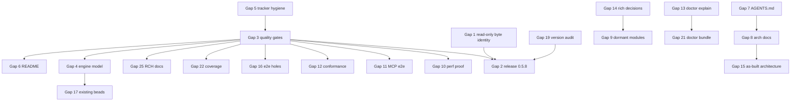

# Bridge Plan: beads_rust (`br`)

**Reality check date:** 2026-09-01
**Baseline:** installed `br 0.5.7` = Cargo.toml 0.5.7 = latest GitHub release (2026-08-29); `main` at `ebc34bd7` (fsqlite 0.3.14)
**Gap count:** 5 critical, 12 major, 8 minor (25 gaps)
**Beads:** 16 open / 5 in_progress / 954 closed at check time; every open bead is unblocked
**Estimated work:** ~2 focused agent-weeks of code plus ~1 week of docs/tracker hygiene; the engine-boundary items depend on upstream FrankenSQLite

This document is the Phase 2 output of the reality-check workflow. It is meant to be revised **in place** during ambition rounds and then converted into beads with the frozen Phase 3a template. Every gap below carries enough context that a bead generated from it can stand alone.

---

## 1. Where the project actually is

### 1.1 What the reality check established

| Claim | Evidence |
|---|---|
| The CLI is real, not scaffolding | 88 leaf subcommands; exhaustive `match` in `src/main.rs:585-910` with no catch-all; zero `todo!`/`unimplemented!`/TODO/FIXME in production code; only stub is `br doctor explain` (`src/cli/commands/doctor_subsystems/surface.rs:1951`); only ignored flag is `br doctor capabilities --command` (`surface.rs:146`) |
| The shipped binary works end to end | 83-step lifecycle smoke against installed 0.5.7: init, create, deps, ready/blocked, labels, comments, claim, defer/undefer, close/reopen, epic, lint, auto-flush, all sync modes, doctor, migrate-schema plan, capabilities/schema/robot-docs, TOON, completions, config, agents, orphans, changelog, tombstone delete, capacity hard limit, cross-project routing, external deps. 81 passed; the 2 failures were README syntax the CLI rejects (see Gap 6) |
| Sync safety invariant holds | `grep -rn 'Command::new.*git' src/sync/ src/cli/commands/sync.rs` is empty; bare `br sync` refused; 13 git-safety e2e tests in `tests/e2e_sync_git_safety.rs` |
| Latency is far inside the plan's targets | On the project's own 977-issue tracker: `ready`, `list --limit 0`, `show`, `stats`, `blocked`, `sync --status` each ~10 ms; `doctor --json` ~0.8 s |
| Unit suite on `main` has exactly one known failure | `cli::commands::doctor::tests::pending_sync_merge_authority_inspector_is_coherent_and_byte_identical` (GitHub #476) fails deterministically at `src/cli/commands/doctor.rs:14257`; the 11 lib failures recorded in bead `beads_rust-9krz` now pass; partial full run 1066 passed / 1 failed / 5 ignored |
| `cargo fmt --check` clean | local run |
| `cargo clippy --all-targets -- -D warnings` | **inconclusive**: killed by RCH's 5-minute cap on two workers; the last CI clippy run (2026-08-19) failed |
| Full integration suite | **could not complete** through RCH: a cold compile of 162 test binaries exceeds the 30-minute cap; UPGRADE_LOG.md (2026-08-14) recorded 21,490 passed / 0 failed |

### 1.2 Vision checklist (condensed)

Status legend: WORKING, PARTIAL, STUB, UNPROVEN, NOT_STARTED, DEFERRED, WRONG_APPROACH.

| # | Goal | Source | Status | Gap |
|---|---|---|---|---|
| V1 | Classic bd command set ported (CRUD, deps, labels, comments, sync, stale, orphans) | porting plan | WORKING | — |
| V2 | SQLite + JSONL hybrid frozen; no Dolt | porting plan, README | WORKING | — |
| V3 | Non-invasive: never runs git for sync, no hooks, no daemon | README §Design 1, 3 | WORKING | — |
| V4 | Schema compatible with Go bd | PROPOSED_ARCHITECTURE | WORKING (superset) | — |
| V5 | Hash-based IDs, content-hash dedup | README, AGENTS.md | WORKING (hash format intentionally diverged at schema v14) | G7 |
| V6 | Output parity with Go bd proven by conformance tests | porting plan | UNPROVEN (workflow disabled; skips without a real `bd`) | G12 |
| V7 | Every command supports `--json`; clean stdout; structured errors with exit codes | README §Design 4, AGENTS.md | WORKING | — |
| V8 | TOON output and env precedence | AGENTS.md | WORKING | — |
| V9 | Rich TTY output, Plain when piped, NO_COLOR | README §Design 5 | WORKING | — |
| V10 | Syntax highlighting and markdown rendering in `show` | RICH_INTEGRATION_PLAN §5 | STUB / unwired | G14 |
| V11 | Sync never touches `.git/`; `.beads/` allowlist; atomic publish; conflict-marker refusal; `--force` gating | README §Safety Model | WORKING | — |
| V12 | "No data loss" guarantee | README §Safety Model | REGRESSED in Aug (GH #457/#458/#460/#461), fixed in 0.5.5-0.5.7; #471/#474 fixed only at HEAD | G1, G2, G4 |
| V13 | 3-way merge, reconcile, reconcile-additive with hash-bound plans, salvage, source-path migration | README §Troubleshooting | WORKING (#473 dry-run fix unreleased) | G2 |
| V14 | Local history backups with list/diff/restore/prune | README | WORKING | — |
| V15 | Workflow policy: ready groups, capacity (statuses/groups/admission/counting/exemptions/scopes), required fields, gates | README §Workflow Policy | WORKING (#466 gate_results fix unreleased) | G2 |
| V16 | Coordination status / stale-claim evidence | README FAQ, COORDINATION_EVIDENCE | WORKING | — |
| V17 | Cross-project routing, town discovery, external deps | README FAQ | WORKING | — |
| V18 | Doctor: diagnostics, repair sessions, schema migration plan/apply/undo, fixtures | README, docs | WORKING except `doctor explain` stub, `--bundle` absent | G13, G21 |
| V19 | MCP server: 7 tools, 12 resources, 4 prompts, same lock model | README, AGENTS.md | WORKING in code; protocol behavior UNPROVEN by tests | G11 |
| V20 | Startup < 100 ms cold / < 50 ms warm; "br faster than bd" | PROPOSED_ARCHITECTURE App. C, porting plan | UNPROVEN (benches ignored, self-comparing budget) | G10 |
| V21 | Regression budgets enforced in CI | ci.yml bench job | DISABLED | G3, G10 |
| V22 | Pluggable `Storage` trait; module decomposition | PROPOSED_ARCHITECTURE §1.1, §5.1 | NOT_STARTED / WRONG_APPROACH (one 38k-line file) | G15 |
| V23 | Write-combining queue; S3-FIFO cache | WRITE_COMBINING_QUEUE_DESIGN, `src/cache.rs` | DEFERRED, dormant code | G9 |
| V24 | Cross-platform single-binary releases, signed, checksummed, installer, package manifests | README §Installation | WORKING | G23 |
| V25 | `cargo install --git ... --locked` works from crates.io deps | README | WORKING (0.5.7 on crates.io) | — |
| V26 | Self-update | README | WORKING | — |
| V27 | Property, fuzz, snapshot, failure-injection, concurrency testing | docs/TESTING_GUIDELINES, ci.yml | WORKING (but no gate runs them) | G3 |
| V28 | Zero unsafe code | AGENTS.md | PARTIAL by design (`deny` + 4 carve-outs) | G7 |
| V29 | Docs are accurate enough for agents to act on | AGENTS.md purpose | FAILING (README config keys, AGENTS.md structure, ARCHITECTURE.md claims) | G6, G7, G8 |
| V30 | Beads are the single source of truth for status | AGENTS.md | FAILING (5 stale claims; August work untracked) | G5 |
| V31 | Windows support | README "Works on Linux, macOS, Windows (WSL)"; GH #438/#439/#413/#419 | PARTIAL (open beads txwk, gc8l) | G18 |
| V32 | Broken-pipe safety for text output | GH #434, bead 3fna | PARTIAL | G18 |
| V33 | Acceptance-criteria as structured data | GH #477 | NOT_STARTED | G20 |

### 1.3 Would completing all open beads close the gap?

**No.** The 16 open beads are 8 sync bugs, 6 storage/engine bugs (4 of them upstream FrankenSQLite escalations), and 3 test tasks. They cover parts of G4, G18 and G19 only. Nothing tracks G1, G2, G3, G5, G6, G7, G8, G9, G10, G11, G12, G13, G14, G15, G16, G17, G20, G21, G22, G23. The 5 in_progress beads are all stale agent claims; one (`beads_rust-uri0`) is finished per its own comments.

---

## 2. Critical gaps (block the vision or violate a stated guarantee)

### Gap 1: Read-only authority inspection mutates database bytes — REGRESSED → WORKING

**Current state:** `SqliteStorage::inspect_pending_sync_merge_under_authority` (`src/storage/sqlite.rs:19771`) opens the database through `open_current_read_only` (`src/storage/sqlite.rs:2503`), which calls `open_with_flags(..., SQLITE_OPEN_READ_ONLY)` after registering a `DatabaseOpenerLease`. The unit test at `src/cli/commands/doctor.rs:14234` snapshots the db/wal/shm/journal bytes before and after (`database_family_bytes`, `doctor.rs` test module) and fails: the main file header (change counter / version-valid-for region) differs. This is GitHub #476, reproduced on `main` at fsqlite 0.3.13 and 0.3.14. The contract "read-only inspection is byte-identical" is a stated invariant and the doctor path that relies on it runs during recovery.

**Target state:** the inspection leaves every database-family file byte-identical; the unit test passes on Linux and macOS; the root cause is understood and either fixed in fsqlite or isolated in br.

**Success criteria:**
- [ ] `cargo test --lib pending_sync_merge_authority_inspector_is_coherent` passes on Linux and macOS.
- [ ] A new unit test asserts byte-identity for `open_current_read_only` alone on a fresh v17 database with and without a live WAL, so the invariant is pinned at the storage layer rather than only in doctor.
- [ ] If the cause is upstream, a minimal repro is filed against frankensqlite and linked from the bead; br carries a documented mitigation.

**Implementation plan:**
1. Bisect the write: wrap the fsqlite open in the test with a byte diff to confirm whether the header bump happens at open, at `connection_user_version`, or at `conn.close()`. Check whether fsqlite honors `SQLITE_OPEN_READ_ONLY` for header updates and whether an `immutable`-style open mode exists in fsqlite 0.3.x.
2. If fsqlite writes on read-only open: file upstream with the repro; in br, make `open_current_read_only` observational by reading the header/user_version via `checked_database_header_user_version` plus a WAL-aware peek that does not require a connection, and only open a connection when a mutation authority is held. Alternatively, inspect a snapshot copy of the family in a temp dir under the write authority (the sync code already has a byte-snapshot pattern in `src/sync/mod.rs`).
3. If the write is br's own (e.g., a checkpoint or pragma on close), remove it from the read-only path.
4. Add the storage-level byte-identity test next to the existing `open_current_read_only` tests.
5. Add a doctor check `db.read_only_open_is_observational` that runs this probe on a temp copy so the invariant is monitored at runtime, not only in tests.

**Dependencies:** none. Blocks Gap 2.
**Estimated complexity:** M
**Vision goals served:** V12, V18
**Bead coverage:** NONE. Create a bead; link GH #476.

### Gap 2: Six user-reported fixes exist only at HEAD; release 0.5.8 — PARTIAL → WORKING

**Current state:** Commits `d2393c99`, `70e7fed9`, `d461a399`, `676e57bc`, `10ea8ece`, `087ce812`, `34ca862b`, `ebc34bd7` are after the `v0.5.7` tag. They fix GH #466 (`gate_results` never written), #467 (`br update` silently replacing non-empty text fields), #471 (`doctor --repair` discarding `events`, `gate_results`, `gate_result_history`, `close_metadata`, `capacity_*` tables), #473 (`--reconcile-additive --dry-run` unreachable), #474 (bypass-policy audit never exported), #475 (`br list --tree`), two cross-issue comment-ID collision bugs, and bump fsqlite to 0.3.14. Users on 0.5.7 have all of these bugs, three of which are silent data-loss or silent-audit-loss class.

**Target state:** `v0.5.8` released with these fixes, a green gate, and a CHANGELOG entry that names each GH issue.

**Success criteria:**
- [ ] `br --version` from the release asset prints 0.5.8; `cargo install --git ... --locked` resolves 0.5.8.
- [ ] Release gate (Gap 3) passed on the release commit, including `cargo test --lib`.
- [ ] CHANGELOG.md lists #466, #467, #471, #473, #474, #475, the comment-ID fixes, fsqlite 0.3.14.
- [ ] Post-release smoke: the 83-step lifecycle script passes against the downloaded asset on linux_amd64 and darwin_arm64.

**Implementation plan:**
1. Land Gap 1 first, or explicitly quarantine #476 with an `#[ignore]` carrying the issue link and a doctor-side runtime guard, so the release is not shipped with a known-red invariant test.
2. Update `Cargo.toml` version, `README.md` "Verify Installation" block, `.claude-plugin/plugin.json` version (currently 0.5.2), CHANGELOG.
3. Tag and let `release.yml` build; confirm the crates.io publish step is idempotent (the second v0.5.7 run failed only at "Publish to crates.io" because 0.5.7 already existed; add `cargo publish --dry-run`/exists check so a re-run does not report failure).
4. Run the lifecycle smoke script against the published asset and record the receipt in the bead close reason.

**Dependencies:** Gap 1 (or its quarantine), Gap 3 (release gate), Gap 23 (version audit).
**Estimated complexity:** S
**Vision goals served:** V12, V13, V15
**Bead coverage:** NONE. Create a release bead and one bead per fix for traceability (or one bead listing all with the commit SHAs).

### Gap 3: Quality gates are off — DISABLED → WORKING

**Current state:** `gh workflow list --all` shows CI, Security Audit, Conformance, Doctor, Full E2E & Benchmarks, Notify ACFS, and Update Package Manifests all `disabled_manually`; only Release and Dependabot run. The last CI run on main (2026-08-19) failed at "Clippy (all features)" and "Check for yanked dependencies"; scheduled Conformance and Full E2E had been failing weekly. `release.yml` "Release Reliability Gates" runs only four targeted tests (`workspace_failure_replay`, `e2e_sync_failure_injection`, one workspace stress scenario, one concurrency scenario). Bead `beads_rust-9krz` records that DSR (local release) gates skip lib tests. Coverage job is `continue-on-error`. Locally, the full suite cannot complete through RCH because a cold compile of 162 test binaries exceeds its 30-minute cap and `clippy --all-targets` exceeds its 5-minute cap. Net effect: releases ship without any run of the unit suite or clippy.

**Target state:** every push to main and every release runs fmt, clippy (all features and no-default-features), `cargo test --lib`, and a sharded integration suite, inside the time caps of both GitHub Actions and RCH; the results are visible and required.

**Success criteria:**
- [ ] `gh workflow list --all` shows CI, Security Audit, Doctor, Conformance active.
- [ ] A push to main produces a green CI run with jobs: fmt, clippy×2, check, `cargo test --lib`, integration shards, doctor fixture suite.
- [ ] `release.yml` reliability job additionally runs `cargo fmt --check`, `cargo clippy --all-targets --all-features -- -D warnings`, and `cargo test --lib --locked`; a failing lib test blocks the release.
- [ ] `scripts/ci-local.sh` mirrors the CI jobs and each shard finishes in < 25 minutes on an RCH worker from cold.
- [ ] AGENTS.md documents how to run the suite within RCH caps.

**Implementation plan:**
1. Diagnose the 2026-08-19 failures: run `cargo clippy --all-targets --all-features -- -D warnings` on a warm worker and fix or allow the lints per the existing Cargo.toml allow-list policy; install `cargo-audit` and resolve the yanked-dependency finding (`cargo audit --deny yanked`), most likely a transitive crate bumped since.
2. Shard the integration suite in `.github/workflows/ci.yml` "Test Suite": replace the single `cargo test --all-features -- --nocapture` with a matrix of shards, e.g. `lib`, `e2e_a-l`, `e2e_m-z`, `storage+proptest+repro`, `conformance+golden+workflow`, each `cargo test --all-features --test <names>` with `timeout-minutes` sized per shard. Keep `--no-default-features` and `--doc` jobs.
3. Add the same shard list to `scripts/ci-local.sh` and document in AGENTS.md: "Run shards via `rch exec -- cargo test --test <name>`; never a bare `cargo test --all-features` from cold".
4. Re-enable workflows with `gh workflow enable` in this order: Security Audit, CI, Doctor, Conformance, Full E2E; watch one run each and fix what fails before enabling the next.
5. Extend `release.yml` "Release Reliability Gates" with fmt, clippy, and `cargo test --lib --locked` steps before the four existing reliability tests; make the coverage job non-optional or delete it (a `continue-on-error` gate is theater).
6. Add a "gate parity" check to `scripts/build-release.sh` / DSR flow so local releases run the same lib+clippy+fmt steps.
7. Record in `docs/CI_SUPPLY_CHAIN.md` that pinned-action updates must keep the workflows enabled, and add a doctor-style script that fails if any expected workflow is disabled (`gh workflow list --all | grep disabled`).

**Dependencies:** none. Blocks Gap 2 (release gate) and unblocks proof gaps 10, 11, 12.
**Estimated complexity:** L
**Vision goals served:** V21, V27, V6
**Bead coverage:** PARTIAL. `beads_rust-hrhx` (doctor fixtures need `sqlite3` on RCH workers) is related; everything else is uncovered.

### Gap 4: Storage-engine reliability is contained, not resolved — PARTIAL → WORKING

**Current state:** In August, v0.5.3 on fsqlite 0.3.11 corrupted a healthy database family under concurrent multi-process writes (GH #457, #458, #460, #461). A stock-SQLite backend was built and then reverted by the operator; containment landed as a sole-opener WAL checkpoint lease (`.br-db-openers-*.lock`) with stress receipts on worker hz3. Open beads `ro3m` (COUNT over HAVING/IN returns NULL), `f3r4` (B-tree rowid corruption after 264 dep-removes, GH #426), `ajui` (migrate 16→17 leaves integrity_check failing, GH #428), `891u` (VACUUM INTO re-serializes DDL so schema hash never matches), `avhq` (orphan sidecars wedge open) are all engine-boundary issues; Gap 1 is another. The in_progress bead `uri0` ("emergency: replace corrupting fsqlite runtime path") is finished per its own comments and still open at P0. There is no document that states the operating model (FrankenSQLite only, no FFI, sole-opener containment, what stress must pass before an fsqlite bump).

**Target state:** each engine-boundary bug has an upstream issue and a br-side test; fsqlite bumps are gated by the stress harness; the operating model is written down.

**Success criteria:**
- [ ] `docs/reliability/ENGINE_OPERATING_MODEL.md` exists: FrankenSQLite-only decision and why, containment mechanism, sidecar files (`-wal-cert`, `-ns-gate`, `-ns-use`, `.fsqlite-migration-state`), recovery artifacts policy, and the fsqlite-bump checklist.
- [ ] `scripts/br-stress.sh` (multi-process mixed workload) is a required step in `release.yml` and in the dependency-bump workflow, with a pass/fail receipt.
- [ ] Beads `ro3m`, `f3r4`, `ajui`, `891u`, `avhq` each link an upstream frankensqlite issue and carry a br regression test (`tests/repro_*.rs`).
- [ ] `br doctor` reports the engine version and the sole-opener lease state.

**Implementation plan:**
1. Close `uri0` with its recorded outcome (containment at `dedfbed7`, revert of stock-SQLite at `a704e8b8`, releases 0.5.5-0.5.7).
2. Write the operating-model doc from the uri0 comments, `docs/fsqlite_trailing_pages_report.md`, and `docs/SWARM_SCALE_TUNING.md`.
3. Turn `scripts/br-stress.sh` into a gate: fixed N=8 mixed workload for 60 s and 90 s, assert zero recovery artifacts and clean `integrity_check`; wire into `release.yml` after the reliability tests and into Dependabot/`deps-update` handling for `fsqlite*` bumps.
4. For each open engine bead: write the minimal repro as a `tests/repro_*.rs` (marked `#[ignore]` only if it cannot pass yet, with the upstream link in the ignore reason), file upstream, and record the fsqlite version that fixes it.
5. Extend `br doctor --json` with `engine: {name, version, sole_opener_lease, recovery_artifacts}` so incident reports are self-describing.

**Dependencies:** Gap 3 for the gate wiring.
**Estimated complexity:** L (br side) plus upstream time
**Vision goals served:** V12, V2
**Bead coverage:** PARTIAL. Existing: `ro3m`, `f3r4`, `ajui`, `891u`, `avhq`, `uri0` (to close). New beads: operating-model doc, stress gate, doctor engine block.

### Gap 5: The tracker no longer reflects the work — FAILING → WORKING

**Current state:** 270 commits and three releases landed between 2026-08-18 and 2026-09-01 against 12 closed beads; closed-per-month went 165 → 111 → 62 → 11. All five in_progress beads are stale agent claims by the AGENTS.md rule (2 h for agent claims): `0v1.2.4` (IvoryGrove, 36 days, the graph's only blocker), `3r45.1` and `3r45.2` (FoggyPrairie, 36 days), `mwxp` (Codex, 6 days, bypassed by later beads), `uri0` (Codex, 4 days, finished). `br ready` hides in_progress work, so these are invisible. GH issues are being fixed directly from commits without beads, so vision coverage cannot be read from the tracker. Doctor on this repo's own `.beads/` warns that `beads.base.jsonl` is older than `issues.jsonl` and that four recovery artifacts from 2026-08-20 remain.

**Target state:** every in_progress bead has a live owner; every GH-issue fix has a bead or the tracker policy explicitly says GH issues are the record; the backlog contains a bead for every gap in this plan.

**Success criteria:**
- [ ] `br coordination status --json` reports zero stale claims.
- [ ] `uri0` and `9krz` closed with outcome-bearing reasons; `0v1.2.4` verified (README already says `sync --status` never probes git) and closed or re-scoped; `3r45.1`, `3r45.2`, `mwxp` reclaimed with an audit comment or unassigned back to open.
- [ ] Every gap in this plan has at least one bead; `bv --robot-triage` shows no cycles and a non-flat recommendation list.
- [ ] AGENTS.md "Session Protocol" gains one line: a GH issue closed as "fixed on main" must reference a bead ID in the closing comment.
- [ ] `br sync --merge` or a fresh base snapshot refreshes `beads.base.jsonl`; recovery artifacts are triaged via `br doctor --repair --dry-run` and either kept with a note or removed with operator approval.

**Implementation plan:**
1. Run `br show` on each stale claim, add the reclaim/outcome comment per AGENTS.md, then `br close` or `br update --status open --assignee ''`.
2. Create beads from this plan (Phase 3a).
3. Add the GH-issue → bead rule to AGENTS.md and to `docs/agent/` guidance.
4. Refresh the merge base and triage recovery artifacts for this repo's tracker.

**Dependencies:** none.
**Estimated complexity:** S
**Vision goals served:** V30
**Bead coverage:** NONE (this is meta-work on the tracker itself).

---

## 3. Major gaps (significantly degrade the vision)

### Gap 6: README describes commands and config that do not exist — WRONG → WORKING

**Current state:**
- Config example (README lines ~606-628) uses `id.prefix`, `defaults.priority`, `defaults.type`, `defaults.assignee`, `output.color`, `output.date_format`. The code reads `issue_prefix`/`issue-prefix`/`prefix` (`src/config/mod.rs:5531`), `default_priority`/`default-priority` (`:6769`), `default_type`/`default-type` (`:6779`), and `display.color`; there is no default assignee or date-format key. `br config set` writes any key silently, so the README example appears to work and does nothing.
- `br label add <id> backend urgent` fails with "Issue not found: backend"; `parse_issues_and_label` (`src/cli/commands/label.rs:171-204`) treats only the last positional as the label and `--label` is `Option<String>` (`src/cli/mod.rs:2276`), not repeatable.
- `br list --priority 0-1` is rejected; `ListArgs.priority` is `Vec<String>` of single values (`src/cli/mod.rs:1794`); ranges need `--priority-min/--priority-max`.
- "Verify Installation" prints `br 0.5.2`; binary size "~5-8 MB" vs 26.5 MB on disk (11.3 MB compressed); `install.sh --no-migration-skill` does not exist (flags are `--skip-skills`, `--with-migration-skill`); `--robot` is shown as a global JSON alias but exists only on ~25 commands; Global Flags table omits `--actor`, `--no-auto-flush`, `--no-auto-import`, `--allow-stale`, `--lock-timeout`, `--no-db`, `--no-daemon`; Environment table lists 4 of ~25 variables read; Commands tables omit `gate`, `capacity`, `scheduler`, `serve`, `label rename`, `history list/diff/restore`, `query run/list/delete`, `config delete/path`, `audit` subcommands, `doctor` subcommands, `list --tree`; the `sync.auto_flush: false` example silently disables the documented default.

**Target state:** every README example runs as written; the code accepts the more ergonomic forms where the README's intent is better than the code's current behavior; tables are generated from `br capabilities` so they cannot drift.

**Success criteria:**
- [ ] `tests/e2e_readme_examples.rs`: extracts every fenced `bash` block from README.md that starts with `br ` and runs it in a scratch workspace; each command exits 0 (or the documented non-zero code).
- [ ] `br label add <id> a b` and `br label add <id> -l a -l b` both add two labels; `br list --priority 0-1` and `-p 0,1` work; documented.
- [ ] `br config set unknown.key=1` warns "unknown key" listing the nearest known keys; `br doctor` check `config.unknown_keys` warns on unknown keys in `config.yaml`.
- [ ] README Commands, Global Flags, and Environment tables are regenerated by `scripts/generate-readme-tables.sh` from `br capabilities --format json` (which already carries `commands`, `global_flags`, `env_vars`, `exit_codes`), and a test asserts README matches the generator output.
- [ ] Version string, binary size, install flags corrected.

**Implementation plan:**
1. Code: make `LabelAddArgs.label` a `Vec<String>` with `action = Append` and comma delimiter; in `parse_issues_and_label`, when no `-l` is given, treat every trailing positional that does not resolve as an issue ID (after `resolve_issue_id`) as a label; return one clear error when ambiguity remains. Mirror for `label remove`.
2. Code: extend the priority parser used by `list`/`ready`/`blocked`/`count` to accept `N-M` ranges and `P0-P1`, expanding to the set; keep `--priority-min/max`.
3. Code: add a `KNOWN_CONFIG_KEYS` registry in `src/config/mod.rs` derived from the existing getters (`issue_prefix`, `default_priority`, `default_type`, `display.color`, `sync.*`, `external_projects.*`, history keys, routing keys, `no_auto_flush`, etc.); `br config set` warns on unknown keys; add the doctor check.
4. Docs: rewrite the config example with real keys; fix label/priority examples; fix version, size ("~26 MB stripped, ~11 MB compressed"), install flags; state exactly which commands accept `--robot`; add the missing global flags and env vars; add rows for the missing commands.
5. Tooling: write `scripts/generate-readme-tables.sh` and the README-examples e2e test; wire both into CI (Gap 3).

**Dependencies:** Gap 3 for CI wiring; otherwise none.
**Estimated complexity:** M
**Vision goals served:** V29, V7
**Bead coverage:** NONE.

### Gap 7: AGENTS.md misdescribes the codebase agents work in — WRONG → WORKING

**Current state:** AGENTS.md claims `#![forbid(unsafe_code)]` (actual: `deny` with carve-outs at `src/shutdown.rs:89,210` and `src/sync/db_inode_lock.rs:130,316`), fsqlite as "path dependencies" (actual: crates.io 0.3.14, 15 crates), `cli/mod.rs` 66 KB / `sqlite.rs` 181 KB / `sync/mod.rs` 176 KB (actual: 125 KB / 1.4 MB / 902 KB), a `src/storage/queries/` directory and `src/format/context.rs` that do not exist, a `Label` type that does not exist (labels are `Issue.labels: Vec<String>`), a feature block missing `mcp`, an MCP resource list missing `beads://coordination/status`, a test-category table missing golden/workflow/bench/package-manifest/replay suites, a project tree missing `cache.rs`, `close_policy.rs`, `coordination.rs`, `franken_sync.rs`, `health.rs`, `inheritance.rs`, `policy.rs`, `shutdown.rs`, `write_combining.rs`, `mcp/`, `sync/witness.rs`, `sync/db_inode_lock.rs`, `cli/commands/doctor_subsystems/`, and dispatch attributed to `cli/mod.rs` when it lives in `src/main.rs:585`. The "Go parity" bullet does not say conformance requires a real `bd` and that `content_hash` parity was intentionally broken at schema v14 (`src/util/hash.rs:1-7`).

**Target state:** every structural claim in AGENTS.md is true and checkable; volatile facts (sizes) are removed; a test guards the module tree.

**Success criteria:**
- [ ] `tests/agents_md_contract.rs`: parses the Project Structure block and asserts every listed path exists and every `src/*.rs` and `src/*/` module is listed.
- [ ] Unsafe policy paragraph names `deny` and the four carve-outs with their GitHub issue numbers.
- [ ] Dependencies table matches `Cargo.toml` (add `asupersync`, `fastmcp-rust`, `mimalloc`, `rustix`, `signal-hook`, `cap-primitives`, `windows-sys`, `dunce`, `similar`, `shell-words`, `serde_norway`, `sha1`, `self-replace`, `vergen-gix`, `clap_complete`).
- [ ] Feature block lists `mcp`; MCP resource list includes `beads://coordination/status`; test table lists every suite family in `tests/`.
- [ ] A "Running tests under RCH caps" section exists (from Gap 3).

**Implementation plan:**
1. Rewrite the Toolchain, Key Dependencies, Architecture, Project Structure, Key Files, Feature Flags, Core Types, and MCP sections from the code; drop byte sizes.
2. Add the contract test; add it to the CI `lib` shard.
3. Qualify the Go-parity bullet.

**Dependencies:** none.
**Estimated complexity:** S
**Vision goals served:** V29, V28
**Bead coverage:** NONE.

### Gap 8: Architecture and agent docs carry false claims — WRONG → WORKING

**Current state:** `docs/ARCHITECTURE.md` says ~33k LOC (actual ~241k), describes structured-error JSON keys `recovery_hints`/`kind`/`error_code` (actual `hint`/`code`), names a `blocked_cache` table (actual `blocked_issues_cache(issue_id, blocked_by, blocked_at)`), and uses health words `drifted`/`quarantined` that do not exist in `src/health.rs`. `docs/agent/AGENT_FRIENDLINESS_REPORT.md` states "Decision: CLI-only (no MCP surface in this repo)". `docs/agent/AGENT_FRIENDLY_CHANGELOG.md` has one entry for eight months. `docs/plans/RICH_INTEGRATION_PLAN.md` has a 100%-unchecked migration checklist though most of it shipped. `docs/E2E_COVERAGE_MATRIX.md` is dated 2026-05-08 and lacks rows for `gate`, `capabilities`, `coordination`, `robot-docs`, `scheduler`, `serve`. `docs/reliability/HEALTH_CONTRACT.md` documents 22 anomaly classes but `src/health.rs` has 25. `src/output/mod.rs:6-14` doc comment omits the env step of mode detection.

**Target state:** each document is either correct or marked historical with a pointer to the current source of truth.

**Success criteria:**
- [ ] ARCHITECTURE.md: LOC figure replaced by `tokei`/`wc` output with a date, error envelope example copied from a real `br show nope --json` run, table names taken from `src/storage/schema.rs`, health vocabulary taken from `src/health.rs`.
- [ ] AGENT_FRIENDLINESS_REPORT.md updated to describe the MCP surface; AGENT_FRIENDLY_CHANGELOG.md has entries for capabilities, coordination, gate, capacity, scheduler, serve, `list --tree`, `update` overwrite guard.
- [ ] RICH_INTEGRATION_PLAN.md checklist ticked to match reality with a "Deferred" section for syntax highlighting, update-diff display, `--ascii`/`TERM=dumb`, theme variants.
- [ ] E2E_COVERAGE_MATRIX.md regenerated with rows for every top-level command and dated.
- [ ] HEALTH_CONTRACT.md lists all 25 anomaly classes; `src/output/mod.rs` doc comment fixed.

**Implementation plan:** one docs pass per file, each verified against code by the same grep/run that found the drift; add `docs/README.md` index marking `porting/` and `plans/` as historical unless dated within 90 days.

**Dependencies:** none.
**Estimated complexity:** M
**Vision goals served:** V29
**Bead coverage:** NONE.

### Gap 9: Designed-but-unwired modules (~5,000 lines) — DEFERRED → decided

**Current state:** `src/write_combining.rs` (2,910 lines) is referenced only by `tests/bench_contention_replay.rs`; `src/cache.rs` (641 lines) has zero references from `src/` or `tests/`; `src/format/rich.rs`, `src/format/theme.rs`, `src/format/syntax.rs` (a stub that discards the language), `src/format/markdown.rs` (`render_rich_markdown`, real but uncalled), `src/output/components/{dep_tree,progress,stats}.rs`, and `OutputContext::error_panel` have zero production callers. `lib.rs` exports `cache` and `write_combining` publicly. `docs/WRITE_COMBINING_QUEUE_DESIGN.md` says "design artifact only".

**Target state:** each module is either wired to a user-visible path with tests, or removed (removal of files requires explicit operator approval per AGENTS.md Rule 1), or kept with an explicit "dormant, reason, owner, revisit date" note in the module header and in ARCHITECTURE.md. No module is silently dead.

**Success criteria:**
- [ ] A decision table in ARCHITECTURE.md lists each module with WIRE / REMOVE / KEEP-DORMANT and the reason.
- [ ] Every KEEP-DORMANT module has `#![doc = "Status: dormant ..."]` at the top and is excluded from the "what br does" narrative.
- [ ] Every WIRE module has a caller and an e2e test; every REMOVE module was deleted only after written approval, with the design doc archived.
- [ ] `cargo build` produces no `dead_code` allowances that exist only to hide these modules (audit `#[allow(dead_code)]` sites, e.g. `doctor.rs:258,345`, `sync.rs:557`, `close.rs:309` whose "WP1 scaffold" comments are stale).

**Implementation plan:**
1. Recommend: WIRE `format/markdown.rs` into `br show` behind `--render-markdown` (or default in Rich mode) with a golden snapshot; WIRE `components/dep_tree.rs` into `br dep tree` Rich mode or remove; KEEP-DORMANT `write_combining.rs` with the bench as its only consumer and a revisit trigger ("when `.write.lock` wait p95 > X ms in `bench_contention_replay`"); REMOVE-or-KEEP decision on `cache.rs` for the operator; `format/rich.rs` and `format/theme.rs` are superseded by `output/context.rs` and are REMOVE candidates; `format/syntax.rs` stays a stub only if Gap 14 says so.
2. Remove stale `#[allow(dead_code)] // WP1 scaffold` annotations on live types.

**Dependencies:** Gap 14 for the syntax/markdown decision.
**Estimated complexity:** M
**Vision goals served:** V23, V10, V29
**Bead coverage:** NONE.

### Gap 10: Performance promises are unproven — UNPROVEN → WORKING

**Current state:** The only quantified targets (< 100 ms cold, < 50 ms warm; "br faster than bd") come from PROPOSED_ARCHITECTURE Appendix C and the porting plan. `tests/bench_cold_warm_start.rs` records millis to JSON but its four benches are `#[ignore]`d (lines 1126-1310), self-skip without `bd`, and swallow errors; its "enforcing" policy (`:854-861`) hardcodes `p95_delta_pct: Some(0.0)`, comparing a run to itself. `tests/benchmark_comparison.rs` times both binaries but asserts no ordering. The CI bench job (10% mean regression gate) is disabled with CI. Meanwhile the real numbers are ~10 ms warm on a 977-issue tracker, so the promise is almost certainly met and simply unasserted.

**Target state:** startup and core-command latency are asserted in a non-ignored test with explicit thresholds; regression budgets compare against a committed baseline manifest; the bd comparison is optional but real when `bd` is present.

**Success criteria:**
- [ ] `tests/perf_latency_contract.rs` (not ignored) builds the release binary once, runs `br ready --json`, `br list --json`, `br show --json` on the 1k and 10k synthetic datasets from `tests/bench_synthetic_scale.rs`, and asserts p95 < 50 ms warm and < 100 ms cold on CI-class hardware, with the thresholds in one constants block and the measured numbers printed.
- [ ] `bench_cold_warm_start` compares against `baseline/perf-evidence-manifest.json` committed under `tests/artifacts/`, and `p95_delta_pct` is computed, not hardcoded.
- [ ] CI bench job re-enabled (Gap 3) and green.
- [ ] README gets a one-line measured-performance statement with the date and dataset.

**Implementation plan:**
1. Write the latency contract test using `assert_cmd` and the existing synthetic dataset builders; run it in the `storage+proptest` shard.
2. Fix the manifest comparison in `bench_cold_warm_start.rs`; generate and commit the baseline from a CI run.
3. Make `benchmark_comparison.rs` emit a ratio and warn (not fail) when br is slower than bd on any op; fail only when `BR_BENCH_STRICT=1`.

**Dependencies:** Gap 3.
**Estimated complexity:** M
**Vision goals served:** V20, V21
**Bead coverage:** NONE.

### Gap 11: MCP protocol behavior is unproven — UNPROVEN → WORKING

**Current state:** `src/mcp/` implements 7 tools, 12 resources, 4 prompts with 80 unit tests; `run_serve` (`src/mcp/mod.rs:1191`) drives `StdioTransport::stdio()`. The only integration test is `tests/e2e_mcp_shutdown.rs`, which launches `br serve` and tests signal handling, never a JSON-RPC exchange. `mcp` is a non-default feature, so a default build has no `serve` subcommand; README documents this but AGENTS.md's feature block does not.

**Target state:** a stdio JSON-RPC e2e proves initialize, tools/list, resources/list, prompts/list, one read tool, one mutating tool with a database check, and resource templates; the MCP feature is built in CI.

**Success criteria:**
- [ ] `tests/e2e_mcp_protocol.rs` (`#![cfg(feature = "mcp")]`): spawns `br serve --actor test`, writes newline-delimited JSON-RPC (`initialize`, `notifications/initialized`, `tools/list`, `resources/list`, `prompts/list`, `tools/call create_issue`, `tools/call list_issues`, `resources/read beads://issues/{id}`), asserts schema-valid responses, then verifies via `br show --json` that the created issue exists and that an audit event with actor `test` was recorded.
- [ ] CI `--all-features` shard builds and runs it; `e2e_mcp_shutdown` stays.
- [ ] `br capabilities --format json` reports whether the binary was built with `mcp`.
- [ ] Decision recorded whether `mcp` should join `default` features (binary-size cost measured and stated).

**Implementation plan:**
1. Write the protocol test reusing the env-scrubbing helper from `e2e_mcp_shutdown.rs`.
2. Add `features: {mcp: bool}` to the capabilities envelope (`src/cli/commands/capabilities.rs`).
3. Measure release binary size with and without `mcp`; record the decision in README "Enable MCP Server Support".

**Dependencies:** Gap 3.
**Estimated complexity:** M
**Vision goals served:** V19
**Bead coverage:** NONE.

### Gap 12: Go-bd conformance is not exercised — UNPROVEN → WORKING

**Current state:** `tests/conformance*.rs` (~228 tests) compare br against a real Go `bd` found via `BD_BINARY`/PATH and skip entirely when absent (`tests/common/binary_discovery.rs`). `conformance.yml` builds bd v0.46.0 from source weekly but is disabled and had been failing since at least 2026-08-03 (failing step: "Run conformance tests"). AGENTS.md states parity as a fact.

**Target state:** conformance runs on a schedule and on demand with a pinned bd, its failures are triaged into "intentional divergence" (documented) or bugs, and the docs describe the parity boundary honestly.

**Success criteria:**
- [ ] `conformance.yml` enabled and green, or each failing test either fixed or annotated with an intentional-divergence reason in `docs/CONFORMANCE_DIVERGENCES.md`.
- [ ] `scripts/conformance.sh` documents how to obtain the pinned bd locally.
- [ ] AGENTS.md/README say: "Conformance against classic bd v0.46.0 is verified on a schedule; content-hash bytes intentionally differ since schema v14."

**Implementation plan:** run the suite on a warm worker with the pinned bd, classify failures, fix or document, re-enable the workflow (Gap 3 step 4).

**Dependencies:** Gap 3.
**Estimated complexity:** M
**Vision goals served:** V6
**Bead coverage:** NONE.

### Gap 13: `br doctor explain` is a stub and `doctor capabilities --command` is ignored — STUB → WORKING

**Current state:** `execute_explain` (`surface.rs:1951-1988`) echoes the finding id inside a fixed "WP6 stub" envelope. Doctor checks already carry `details.finding_id` (e.g. `fm-state_files-merge-artifact-stuck`) and each run writes `report.json` under the doctor run directory (`doctor_subsystems/run_dir.rs`). `doctor capabilities --command <id>` binds the value to `_filter` and never uses it (`surface.rs:146`), while the help text says "reserved for future".

**Target state:** `br doctor explain <finding-id>` returns the check's evidence, the affected paths, the remediation command, and the last observed status from the latest run; `--command` filters capabilities or is removed.

**Success criteria:**
- [ ] `br doctor explain fm-state_files-merge-artifact-stuck --json` returns `{finding_id, check_name, status, observed_at, evidence: [...], paths: [...], remediation: {command, dry_run_command, docs_url}}` sourced from the latest `report.json` or a fresh targeted run when none exists.
- [ ] Unknown finding ids return exit 4 with the nearest known ids.
- [ ] `br doctor capabilities --command doctor` filters, or the flag is deleted and the help text updated.
- [ ] e2e test in `tests/e2e_doctor_chokepoint.rs` covers both.

**Implementation plan:** build a finding registry from the check list (name → finding_id → remediation), read the latest run report, and render; remove the stub strings.

**Dependencies:** none.
**Estimated complexity:** M
**Vision goals served:** V18
**Bead coverage:** NONE.

### Gap 14: Rich-output plan items never closed — STUB → decided/WORKING

**Current state:** Syntax highlighting is a stub (`src/format/syntax.rs:88` returns plain text; `AVAILABLE_THEMES = ["plain"]`), deferred only in a Cargo.toml comment ("until the upstream syntect stack drops unmaintained transitive crates"). Markdown rendering exists but is uncalled. Update-diff display, `--ascii`/`TERM=dumb`/`COLORTERM` accessibility, and dark/minimal themes were planned and never built.

**Target state:** a recorded decision per item, with the ones that ship wired and tested.

**Success criteria:**
- [ ] RICH_INTEGRATION_PLAN.md "Deferred" section names each item, the reason, and the trigger to revisit.
- [ ] If markdown rendering ships: `br show` renders description/design/notes as markdown in Rich mode, plain in Plain mode; golden snapshots in `tests/golden_rich_panels.rs`.
- [ ] If accessibility ships: `TERM=dumb` and `--ascii` produce box-drawing-free output; test in `tests/e2e_global_flags.rs`.
- [ ] Syntax highlighting: either a maintained highlighter is adopted with a size measurement, or the module is removed (approval needed) and the README stops implying it.

**Dependencies:** Gap 9.
**Estimated complexity:** M
**Vision goals served:** V10, V9
**Bead coverage:** NONE.

### Gap 15: Architecture drifted from the plan without amending the plan — WRONG_APPROACH → decided

**Current state:** PROPOSED_ARCHITECTURE specified a `pub trait Storage` (~45 methods) and a module split (`storage/{issues,deps,labels,queries,batch}.rs`, `model/{issue,dependency,...}.rs`, `src/export/`, `src/git/`). Reality: 267 public methods on `SqliteStorage`; `src/storage/sqlite.rs` 38,031 lines; `src/cli/commands/doctor.rs` 25.6k; `src/sync/mod.rs` 24k; `src/config/mod.rs` 12.4k; `src/model/mod.rs` and `src/config/mod.rs` single files. `docs/ARCHITECTURE.md` still claims ~33k LOC total. The porting plan's `duplicates` command was never built; `compact`/`cleanup` were folded into `delete --hard`/`history prune`.

**Target state:** the plan documents say what was built and why it diverged; if the operator wants the decomposition, it is executed isomorphically with proof.

**Success criteria:**
- [ ] `docs/ARCHITECTURE.md` gains an "As built (2026-09)" section: module map with line counts, why no `Storage` trait (single backend by design, fsqlite-only), why the monoliths exist, and the list of plan commands intentionally not built (`duplicates`, `edit`, `compact`, `cleanup`, `--robot-help`).
- [ ] `docs/porting/*.md` and `docs/plans/RICH_INTEGRATION_PLAN.md` get a "historical, see ARCHITECTURE.md" banner.
- [ ] Optional (operator decision): an isomorphic split of `sqlite.rs` into `storage/{issues,deps,labels,search,events,recovery}.rs` with byte-identical CLI output goldens and `cargo public-api`-style diff proof, done with the de-monolithize workflow.

**Dependencies:** none for the docs; Gap 3 for any split.
**Estimated complexity:** S (docs) / XL (split)
**Vision goals served:** V22, V29
**Bead coverage:** NONE.

### Gap 16: E2E coverage holes and a weak acceptance guard — PARTIAL → WORKING

**Current state:** No e2e file exercises `br agents` (the AGENTS.md rewriter that edits files outside `.beads/`); `info --schema` has zero test hits; `delete --cascade` has no execution scenario; `tests/e2e_workflow_capacity_scopes.rs:272` only asserts that GH384 matrix test *names* exist, not that they assert the criteria; nine sync tests are `#[ignore]`d (bead `mzpz`); 14 doctor fixtures fail on RCH workers for lack of `sqlite3` (bead `hrhx`).

**Target state:** every top-level command has an e2e file; the acceptance guard checks behavior; no ignored tests without an issue link.

**Success criteria:**
- [ ] `tests/e2e_agents.rs` covers `--add`, `--force`, idempotency, refusal outside a repo, and that only the requested file changes.
- [ ] `info --schema` and `delete --cascade` scenarios added to existing e2e files.
- [ ] GH384 guard replaced by a table mapping criterion → test → asserted expression, verified by running each test.
- [ ] `mzpz`'s nine ignored tests relocated/fixed; `hrhx` fixtures rewritten to not need `sqlite3` (python3 or fsqlite-based corruption helper).

**Dependencies:** Gap 3.
**Estimated complexity:** M
**Vision goals served:** V27
**Bead coverage:** PARTIAL (`mzpz`, `hrhx`).

### Gap 17: Existing open sync and portability beads — PARTIAL → WORKING

**Current state:** `5a05` (export_hashes upsert lost under a concurrent plain holder, GH #435), `gc8l` (renameat2 fallback on 9p/DrvFS, GH #419), `txwk` (Windows auto-export path authority mismatch, GH #413), `3fna` (text output SIGABRT on closed pipe, GH #434), `zoqe` (vcs-status linked-worktree config), `cnz8` (v0.2.19 minisig key rotation doc, GH #411), `3r45.3` (additive-reconcile adversarial proof matrix), `3r45.4` (CASS recovery rehearsal), and the abandoned `3r45.1` (globally atomic `--merge`), `3r45.2` (single immutable JSONL source snapshot), `0v1.2.4` (git authority removal from sync). These are real vision items (V11, V12, V31, V32).

**Target state:** each is owned, verified against current main (several may already be fixed by August work), and closed with receipts.

**Success criteria:**
- [ ] For each bead: a comment stating "still reproduces at <sha>" or "fixed by <sha>, closing"; verification commands in the comment.
- [ ] `3fna`: `br list | head -1` exits 0 in text mode (test in `tests/e2e_broken_pipe.rs`).
- [ ] `0v1.2.4`: `tests/e2e_sync_git_safety.rs` proves `sync --status` spawns no git; bead closed.
- [ ] Windows beads: a Windows CI shard (Gap 3) runs `e2e_sync_artifacts` and the auto-export scenario.

**Dependencies:** Gap 3 for the Windows shard.
**Estimated complexity:** L in aggregate
**Vision goals served:** V11, V12, V31, V32
**Bead coverage:** YES (existing beads); needs ownership and re-verification, not new beads.

---

## 4. Minor gaps (polish and completeness)

### Gap 18: Repo bloat and tracked junk — WRONG → WORKING

**Current state:** `sample_beads_db_files/` (178 MB of SQLite databases from nine other projects), `custom.db` (172 KB, root), `temp_test/.beads/daemon.log` and siblings, `refactor/artifacts/` (63 files) are tracked; `.DS_Store` files and an empty `=` file sit untracked. Cargo `exclude` already omits them from the crate, so only clones pay.

**Target state:** fixtures live outside the main history or in git-lfs; junk is gone; `.gitignore` prevents recurrence.

**Success criteria:**
- [ ] Operator decision recorded (deletion requires explicit written approval per AGENTS.md Rule 1).
- [ ] If approved: `sample_beads_db_files/` moved to a fixtures repo or git-lfs, `custom.db`, `temp_test*/`, and stale `refactor/artifacts/` removed from the index; clone size reduced and stated.
- [ ] `tests/` that reference `custom.db` use the in-tree fixture under `tests/fixtures/`, not the root file.

**Dependencies:** none. **Complexity:** S. **Vision goals served:** V29. **Bead coverage:** NONE.

### Gap 19: Version and metadata consistency — STALE → WORKING

**Current state:** README "Verify Installation" says 0.5.2; `.claude-plugin/plugin.json` says 0.5.2; `ci.yml` has a "Version Audit" job (disabled).

**Target state:** one version source; release gate fails on drift.

**Success criteria:**
- [ ] `tests/package_manifests.rs` (or the Version Audit job) asserts README, plugin.json, packaging manifests, and CHANGELOG top entry match `Cargo.toml`.
- [ ] `release.yml` runs it before building.

**Dependencies:** Gap 3. **Complexity:** S. **Vision goals served:** V24. **Bead coverage:** NONE.

### Gap 20: Acceptance criteria are an opaque string (GH #477) — NOT_STARTED → WORKING

**Current state:** `acceptance_criteria` is free markdown; `--json` returns it as one string; the #467 overwrite guard makes ticking one box require `--force`.

**Target state:** per-item read/write operations.

**Success criteria:**
- [ ] `br show --json` exposes `acceptance_items: [{index, text, checked}]` parsed from `- [ ]`/`- [x]` lines alongside the raw field.
- [ ] `br update <id> --check-acceptance 2,4` / `--uncheck-acceptance 3` / `--add-acceptance "text"` mutate only those lines, bypass the whole-field guard, and record an event.
- [ ] Round-trip property test: parse → serialize is byte-identical for unchanged lines.

**Dependencies:** none. **Complexity:** M. **Vision goals served:** V33, V7. **Bead coverage:** NONE (GH #477 open).

### Gap 21: `br doctor --bundle` promised but absent — NOT_STARTED → WORKING

**Current state:** `docs/reliability/HEALTH_CONTRACT.md` describes an incident-evidence bundle and says "not yet implemented"; no `--bundle` flag exists.

**Target state:** `br doctor --bundle <path.tar.gz>` writes report.json, health, sidecar listings, lock states, last N events, and redacted config into a tarball; documented in TROUBLESHOOTING.md.

**Dependencies:** Gap 13 (shared finding registry). **Complexity:** M. **Vision goals served:** V18. **Bead coverage:** NONE.

### Gap 22: Coverage gate is theater — PARTIAL → decided

**Current state:** `cargo llvm-cov` job with `continue-on-error: true` and `fail_ci_if_error: false`.

**Target state:** either a real threshold (e.g. no decrease > 0.5 pp vs main) or removal of the job.

**Dependencies:** Gap 3. **Complexity:** S. **Bead coverage:** NONE.

### Gap 23: Release pipeline duplicate assets and idempotency — PARTIAL → WORKING

**Current state:** v0.5.7 carries two asset families: `br-0.5.7-*` (release.yml, with `.minisig`) and `beads_rust-0.5.7-*` (a second uploader, no `.minisig`, slightly different sizes). The second v0.5.7 release run failed at "Publish to crates.io" because the version already existed.

**Target state:** one asset family per release, all signed; re-runs are idempotent.

**Success criteria:**
- [ ] Identify the `beads_rust-*` uploader (DSR or `update-package-manifests.yml`) and either stop it or make it sign and use the same names.
- [ ] `release.yml` publish step checks crates.io before publishing and treats "already published at this version" as success.
- [ ] `docs/INSTALLING.md` states the canonical asset names.

**Dependencies:** none. **Complexity:** S. **Vision goals served:** V24. **Bead coverage:** NONE.

### Gap 24: This repository's own tracker hygiene — WARN → WORKING

**Current state:** `br doctor` on `.beads/` warns `base_jsonl` is older than `issues.jsonl` and four recovery artifacts from 2026-08-20 remain; two foreign `recovery_*` directories (25 MB) sit in `.beads/`.

**Target state:** doctor is fully green on the project's own workspace.

**Dependencies:** none. **Complexity:** S. **Bead coverage:** NONE.

### Gap 25: Developer experience under RCH — PARTIAL → WORKING

**Current state:** RCH kills `cargo clippy --all-targets` at 5 minutes and `cargo test` at 30 minutes; nothing in AGENTS.md says so; agents waste an hour discovering it.

**Target state:** AGENTS.md "RCH" section lists the caps and the shard commands; `scripts/ci-local.sh` accepts a shard name.

**Dependencies:** Gap 3. **Complexity:** S. **Bead coverage:** NONE.

---

## 5. Prioritized execution order

| Wave | Gaps | Rationale |
|---|---|---|
| 0 (today) | 5 (stale claims, close uri0/9krz), 24 | Zero-risk, restores tracker truth before new beads land |
| 1 | 1, 3 | Unblocks a trustworthy release and every proof gap |
| 2 | 2, 19, 23 | Ship 0.5.8 with a real gate and consistent metadata |
| 3 | 6, 7, 8, 25 | Stop agents acting on false docs; cheap, parallelizable |
| 4 | 4, 17 | Engine containment formalized; existing beads re-verified |
| 5 | 10, 11, 12, 16, 22 | Proof gaps: perf, MCP, conformance, e2e holes, coverage |
| 6 | 9, 13, 14, 20, 21 | Finish or retire partials; new small features |
| 7 | 15, 18 | Architecture decision and repo cleanup (operator approval) |

## 6. Dependency graph

## 7. Verification plan (after all bridge work)

- [ ] V1-V4, V7-V9, V11, V13-V17: the 83-step lifecycle smoke (`scratchpad/smoke/smoke.sh` from the 2026-09-01 session, to be promoted to `tests/e2e_scripts/lifecycle_smoke.sh`) passes against the released asset on linux_amd64, darwin_arm64, windows_amd64.
- [ ] V6: conformance workflow green or divergences documented.
- [ ] V10: golden snapshots for markdown rendering; decision recorded for highlighting.
- [ ] V12: `cargo test --lib` green including the byte-identity test; stress gate receipt attached to the release.
- [ ] V18: `br doctor explain <id>` returns evidence; `--bundle` produces a tarball.
- [ ] V19: `e2e_mcp_protocol` green in the `--all-features` shard.
- [ ] V20-V21: latency contract test green; bench job green with a committed baseline.
- [ ] V22, V23: ARCHITECTURE.md as-built section and dormant-module table exist; no undocumented dead modules.
- [ ] V24: single signed asset family; version audit green.
- [ ] V27: all CI workflows enabled and green for three consecutive main pushes.
- [ ] V28, V29: AGENTS.md contract test green; README examples e2e green; generated tables match.
- [ ] V30: `br coordination status --json` shows zero stale claims; every gap has a closed bead with a receipt.
- [ ] V31-V33: Windows shard green; broken-pipe test green; acceptance-item API tests green.
